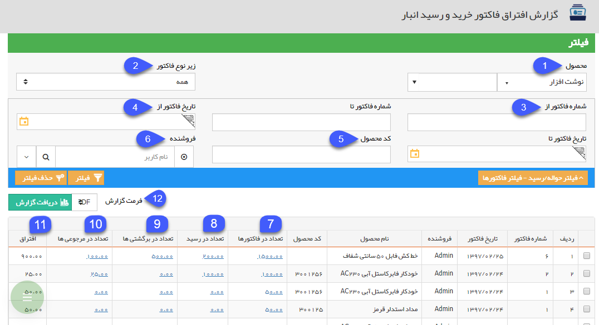

## فاکتور خرید و رسید انبار

> مسیر دسترسی:  **مدیریت و گزارشات** >**گزارشات فروش** > **گزارشات افتراق** > **افتراق فاکتور خرید و رسید انبار**

در این قسمت لیست فاکتور خریدهایی که همه یا تعدادی از اقلام موجود در آن ها از طریق [قیمت گذاری ](https://github.com/1stco/PayamGostarDocs/blob/master/help%202.5.4/Buy-warehouse-sales/Store/gheymatgozari-etesal/gheymatgozari.md)به هیچ رسید انباری وصل نشده است یا از طریق فاکتور برگشت از خرید مرجوع نشده است را می توانید مشاهده کنید.

(به زبان دیگر فاکتور خرید کالا صادر شده است اما مرجوع نشده است و مشخص نیست که کالا به انبار وارد شده است یا خیر)

هر ردیف از جدول نمایش داده شده در این گزارش، نشان دهنده خرید یک محصول می باشد که تعداد خریداری شده از جمع تعداد مرجوع شده ها و اقلام وارد شده به انبار بیشتر است. نحوه نمایش این گزارش به ازای هر ردیف محصول از فاکتورهای خرید می باشد. یعنی اگر در یک فاکتور خرید دو ردیف محصول وارد شده باشد که تعدادی از اقلام کالای هر دو ردیف به هیچ فاکتور برگشت از خرید یا رسید انبار متصل نشده باشند، گزارش افتراق آن ها در دو ردیف مجزا نمایش داده خواهد شد.

1. فیلتر محصول: می توانید گروه محصول یا محصول مورد نظر خود که قصد مشاهده گزارش افتراق مربوط به آن را دارید، انتخاب نمایید.

2. زیرنوع فاکتور: می توانید یکی از زیرنوع های فاکتور خرید تعریف شده در نرم افزار را انتخاب کنید. در این صورت گزارش افتراق مربوط به همان زیرنوع از فاکتور نمایش داده خواهد شد.

3. شماره فاکتور از/تا: می توانید یک حد پایین و یک حد بالا برای شماره فاکتورهای خریدی که قصد مشاهده گزارش افتراق مربوط به آن ها را دارید، در نظر بگیرید.

4. تاریخ فاکتور از/تا: می توانید یک حد پایین و یک حد بالا برای تاریخ فاکتورهای خریدی که قصد مشاهده گزارش افتراق مربوط به آن ها را دارید، در نظر بگیرید.

5. کد محصول: می توانید در این قسمت کد محصولی که قصد مشاهده گزارش افتراق مربوط به آن را دارید، وارد کنید.

6. فروشنده: می توانید از بین کاربران نرم افزار، فروشنده فاکتور خریدهایی که قصد مشاهده گزارش افتراق مربوط به آن ها را دارید، مشخص کنید.

7. تعداد در فاکتورها: در این ستون، به ازای هر فاکتور خرید که همه یا تعدادی از اقلام کالای آن به هیچ رسید انباری متصل نشده اند یا مرجوع نشده اند، تعداد محصول وارد شده در فاکتور خرید نمایش داده می شود، می توانید یا کلیک بر روی لینک نمایش داده شده، فاکتور خرید مربوطه را مشاهده نمایید.

8. تعداد در رسید: در صورتی که برخی از اقلام کالا از طریق قیمت گذاری رسیدهای انبار به این فاکتور خرید متصل شده باشند، تعداد اتصال داده شده در این قسمت نمایش داده می شود. می توانید یا کلیک بر روی لینک نمایش داده شده، رسید/رسیدهای انبار مربوطه را مشاهده نمایید.

9. تعداد در برگشتی ها: در صورتی که برخی از اقلام کالای خریداری شده از طریق فاکتور برگشت از خرید مرجوع شده باشند و فاکتور برگشت از خرید به این فاکتور خرید نگاشت شده باشد، تعداد وارد شده در فاکتور برگشت از خرید در این قسمت نمایش داده می شود، می توانید یا کلیک بر روی لینک نمایش داده شده، فاکتوره/فاکتورهای برگشت از خرید مربوطه را مشاهده نمایید.

10. تعداد در مرجوعی ها: در صورتی که تعدادی از اقلام کالای رسید شده (وارد شده به انبار) از طریق حواله مرجوعی از انبار خارج شوند و آن حواله مرجوعی از طریق قیمت گذاری به رسید انبار اتصال داده شود( توجه داشته باشید که حواله باید به رسید انباری اتصال داده شود که از طریق این فاکتور خرید قیمت گذاری شده باشد)، تعداد وارد شده در حواله مرجوعی در این قسمت نمایش داده می شود. می توانید یا کلیک بر روی لینک نمایش داده شده، حواله/حواله های مرجوعی مربوطه را مشاهده نمایید.

11. افتراق: میزان افتراق محصول در این قسمت نمایش داده خواهد شد. این عدد از طریق زیر به دست می آید:

افتراق= تعداد در فاکتور - (تعداد در رسیدها- تعداد در مرجوعی ها)  - تعداد در برگشتی ها

12. دریافت گزارش: پس از اعمال فیلترهای مورد نظر خود، می توانید اطلاعات نمایش داده شده را با فرمت دلخواه از نرم افزار خروجی بگیرید. شکل زیر نمونه ای از خروجی با فرمت pdf از گزارش افتراق فاکتور خرید و رسید انبار را نمایش می دهد.

