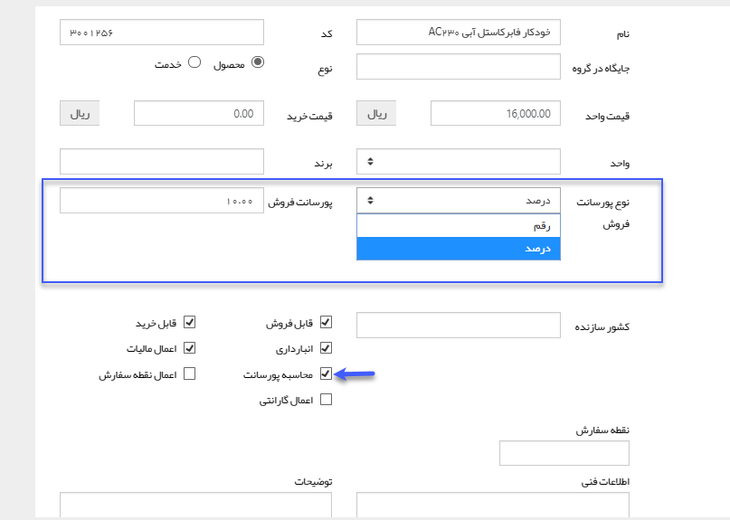
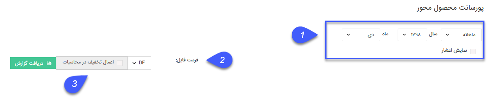
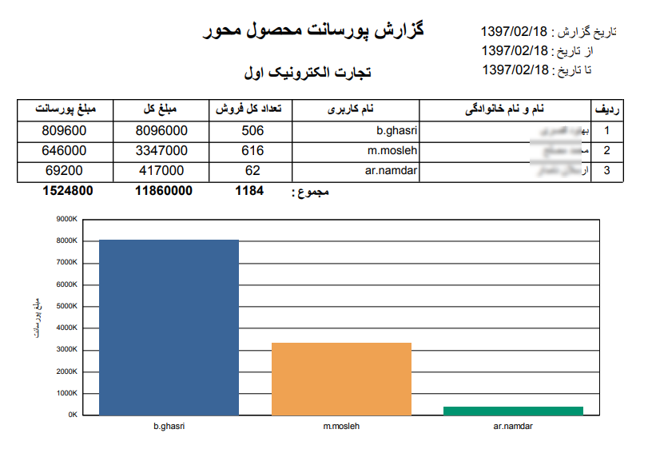

## پورسانت محصول محور

> مسیر دسترسی: **مدیریت و گزارشات** >**گزارشات فروش** > **محاسبه پورسانت** > **پورسانت محصول محور**

نکته : لازم به ذکر است برای دریافت این گزارش بایستی مجوز مدیر فروش  را داشته باشید.

در [ مدیریت محصولات ](https://github.com/1stco/PayamGostarDocs/blob/master/help%202.5.4/Basic-Information/Product%20management/Product-management.md)می توان برای محصولات پورسانت درصدی و یا قیمتی مشخص کرد(مطابق شکل زیر). 

این گزارش، تعداد کالای فروخته شده ، مبلغ فروش و پورسانت کالاهای فروخته شده و جمع کل آنها را در بازه زمانی مشخص شده نمایش می دهد.

> نکته : برای دریافت این گزارش دارا بودن مجوز مدیر فروش الزامی میباشد.

> نکته مهم: توجه داشته باشید که پورسانت هر فاکتور فروش به کاربری تعلق می یگرد که نام او در فیلد "فروشنده" درج شده باشد.

1فیلتر: در قسمت فیلترها، میتوانید بازه زمانی مد نظرتان را برای دریافت این گزارش تعیین کنید.

 2فرمت فایل:در قسمت فرمت فایل، نوع فایل خروجی را انتخاب کرده و روی دریافت گزارش کلیک کنید تا گزارش مورد نظر دانلود شود.

3 اعمال تخفیف در محاسبات: با فعال کردن این گزینه مبلغ نهایی فاکتورها (که تخفیف بر روی آن اعمال شده) در محاسبات گزارش در نظر گرفته میشود.

