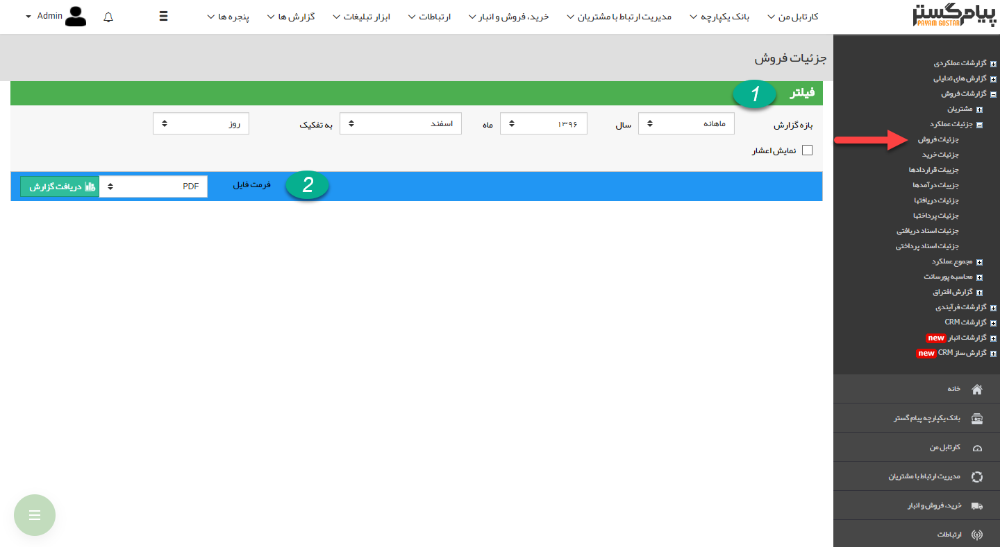

## جزئیات فروش

> مسیر دسترسی: **مدیریت و گزارشات** >**گزارشات فروش** > **جزئیات عملکرد** > **جزئیات فروش**

نکته : لازم به ذکر است برای دریافت این گزارش بایستی مجوز مدیر فروش یا مدیر مالی را داشته باشید.

در این گزارش جزئیات فاکتورهای فروش در بازه زمانی انتخاب شده، نمایش داده می شود.

> نکته : برای دریافت این گزارش بایستی مجوز مدیر مالی یا مدیر فروش را داشته باشید.

1)فیلتر:در قسمت فیلترها، با توجه به بازی زمانی مورد نظر، فیلدها را پر کنید

2) فرمت فایل: در قسمت فرمت فایل، نوع فایل خروجی را انتخاب کرده و روی دریافت گزارش کلیک کنید تا گزارش را با فرمت مورد نظر دانلود شود

