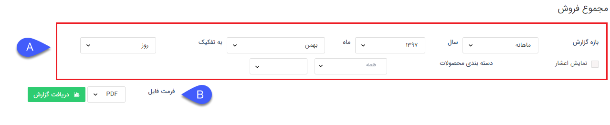
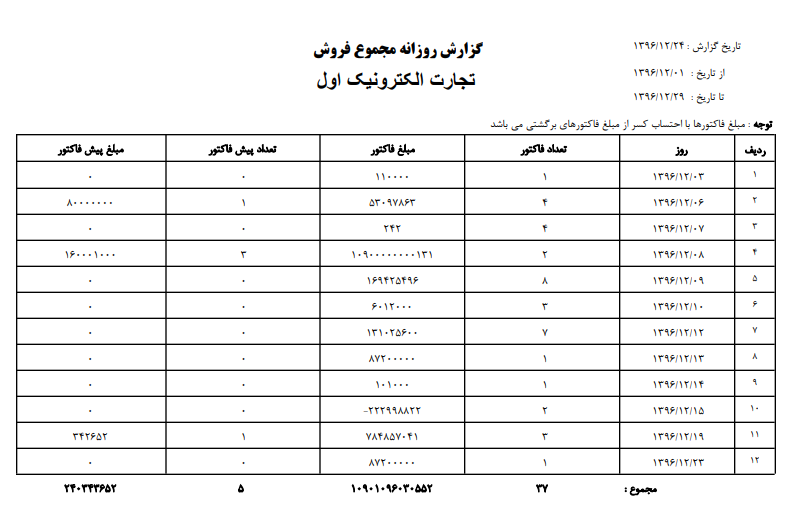

## مجموع فروش 

> مسیر دسترسی: **مدیریت و گزارشات** >**گزارشات فروش** > **مجموع عملکرد** > **مجموع فروش**

نکته : لازم به ذکر است برای دریافت این گزارش بایستی مجوز مدیر فروش یا مدیر مالی را داشته باشید.

در این گزارش تعداد فاکتورها و پیش فاکتورهای فروش و مبالغ کل آنها در بازه زمانی انتخاب شده نمایش داده می شود.

> نکته: توجه داشته باشید که تنها فاکتورها و پیش فاکتورهای تایید شده در این گزارش لحاظ می شوند

> نکته : برای دریافت این گزارش دارا بودن مجوز مدیر مالی و یا مدیر فروش الزامی میباشد.

A . فیلتر: در قسمت فیلترها، میتوانید بازه زمانی و همچنین محصول مورد نظر را برای دریافت گزارش را تعیین کنید.

B . فرمت فایل: در قسمت فرمت فایل، نوع فایل خروجی را انتخاب کرده و روی دریافت گزارش کلیک کنید تا گزارش با فرمت مد نظرتان دانلود شود. 

