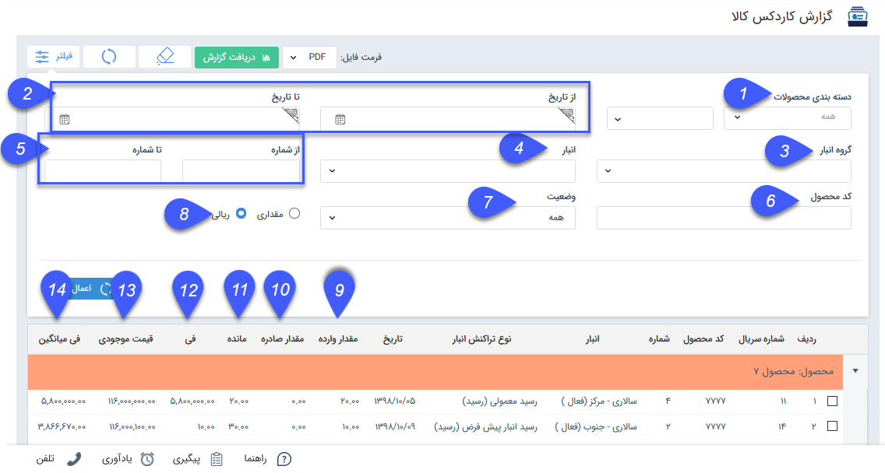
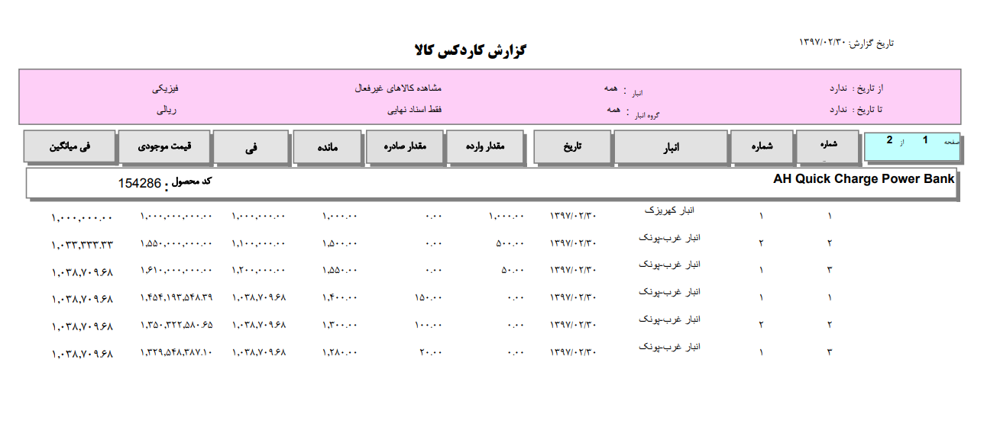

## گزارش کاردکس کالا

> مسیر دسترسی:  **مدیریت و گزارشات** >**گزارشات انبار** > **گزارش کاردکس کالا** 

در این قسمت می توانید لیست تراکنش های اقلام انبار ها را بر اساس مقدار یا ریال مشاهده کنید تا از وضعیت ورود و خروج اقلام انبار آگاهی پیدا کنید. هر ردیف از جدول در این گزارش به معنی یک ورود یا خروج کالا به/از انبار است و به ازای آن می توانید اطلاعاتی مانند مقدار صادره/وارده و فی محصول در آن تراکنش انبار و فی میانگین را مشاهده نمایید.

بمنظور مشاهده لیست تراکنش‌های انبار در ابتدا می بایست از دکمه "به روز رسانی" یا فیلتر بر اساس فیلد های تعریف شده استفاده کرد.

1. دسته بندی محصولات: می توانید با استفاده از این فیلد ، گروه محصول یا محصول دلخواهی را برای گزارش انتخاب نمایید.

2. از تاریخ/تا تاریخ: می توانید بر اساس بازه تاریخی تراکنش انبار را فیلتر کنید .

3. گروه انبار: در صورت نیاز می توانید یک گروه انبار خاص را فیلتر کنید و گزارش کاردکس تراکنش های مربوط به آن گروه انبار را مشاهده کنید.

4. انبار: در صورت نیاز می توانید یک انبار خاص را فیلتر کنید و گزارش کاردکس تراکنش های مربوط به آن انبار را مشاهده کنید.

5. از شماره/ تا شماره: بازه شماره ی تراکنش های انبار را تعیین کنید.

6. کد محصول: در صورت نیاز میتوانید کد محصول مورد نظر را برای فیلتر کردن لیست تراکنش ها وارد کنید.

7. وضعیت : می توان براساس تراکنش های قیمت گذاری شده و یا قیمت گذاری نشده فیلتر کرد .

8.  مقداری/ریالی: می توانید تعیین کنید که تنها مقدار صادره و وارده و مقدار مانده  برای هر سطر از گزارش نمایش داده شود یا علاوه بر موجودی مقداری، موجودی ریالی محصولات نیز نمایش داده شود.

9. مقدار وارده: مقدار محصول وارد شده به انبار به ازای هر رسید انبار در این قسمت نمایش داده می شود. یعنی در واقع در این ستون برای حواله های انبار مقدار صفر نمایش داده می شود.

10. مقدار صادره: مقدار محصول خارج شده از انبار به ازای هر حواله انبار در این قسمت نمایش داده می شود. یعنی در واقع در این ستون برای رسیدهای انبار مقدار صفر نمایش داده می شود.

11. مانده: مقدار مانده محصول در انبار بعد از هر تراکنش در این قسمت نمایش داده می شود. یعنی در واقع مقدار نمایش داده شده در این ستون در آخرین ردیف مرتبط با هر محصول مقدار مانده فعلی محصول در انبارهاست.

> نکته مهم: توجه داشته باشید که این مقدار بر اساس فیلترهای اعمال شده تغییر می کند، یعنی می توانید با استفاده از فیلترهای گروه انبار و انبار، مقدار موجودی را در هر انبار، گروه انبار یا کل انبارها مشاهده کنید.

12. فی: مقدار قیمت وارد شده در قیمت گذاری این تراکنش برای هر قلم کالای محصول در این ستون نمایش داده می شود.

نکته: در صورتی که قیمت گذاری در این تراکنش برای اقلام کالا متفاوت باشد، مقدار فی بر اساس میانگین قیمت وارد شده محاسبه خواهد شد. به طور مثال اگر 100 قلم کالای جاروبرقی وارد شود و 20 قلم با قیمت 1000 ریال و 80 قلم با قیمت 2000 ریال قیمت گذاری شود، فی به صورت زیر بدست می آید.

فی= (20*1000+ 80*2000 )/ 100= 1800

13. قیمت موجودی: موجودی ریالی این محصول در انبار پس از قیمت گذاری این تراکنش، در این ستون نمایش داده می شود.

موجودی ریال = فی * مقدار وارده

>   نکته مهم: توجه داشته باشید که این مقدار بر اساس فیلترهای اعمال شده تغییر می کند، یعنی می توانید با استفاده از فیلترهای گروه انبار و انبار،  موجودی ریالی را در هر انبار، گروه انبار یا کل انبارها مشاهده کنید.

14. فی میانگین: فی میانگین محصول، پس از قیمت گذاری این تراکنش در این قسمت نمایش داده می شود. فی میانگین با استفاده از فرمول زیر بدست می آید:

فی میانگین = (مقدار محصول وارده به انبار* فی)/ مقدار موجود

> نکته: قیمت گذاری حواله های انبار بر اساس فی میانگین می باشد. بنابراین برای سطرهای مرتبط با حواله های انبار، مقدار فی و فی میانگین یکسان است.

 دریافت گزارش: می توانید از گزارش کاردکس کالا با فرمت دلخواه خود خروجی بگیرید. ابتدا فرمت فایل مورد نظر خود را مشخص کرده و سپس روی دریافت گزارش کلیک کنید.
 
 
 

