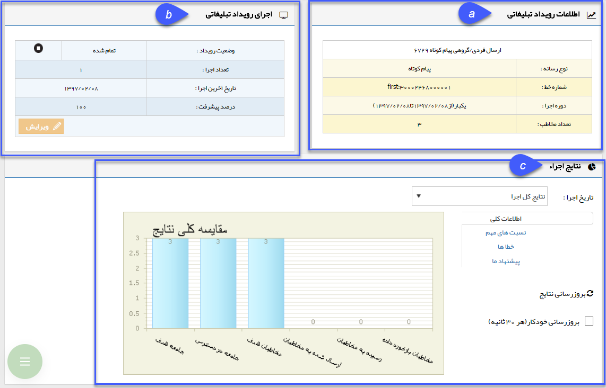
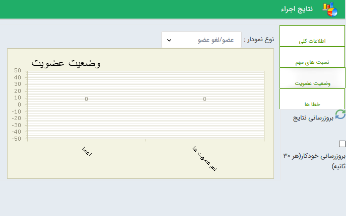
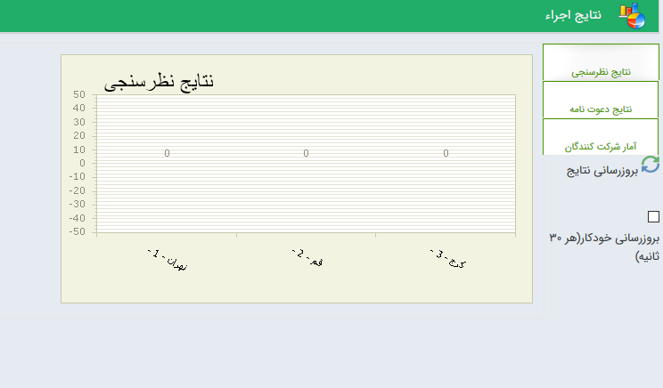
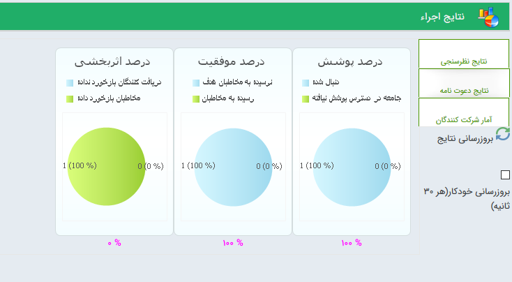
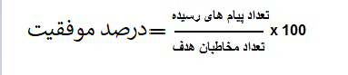
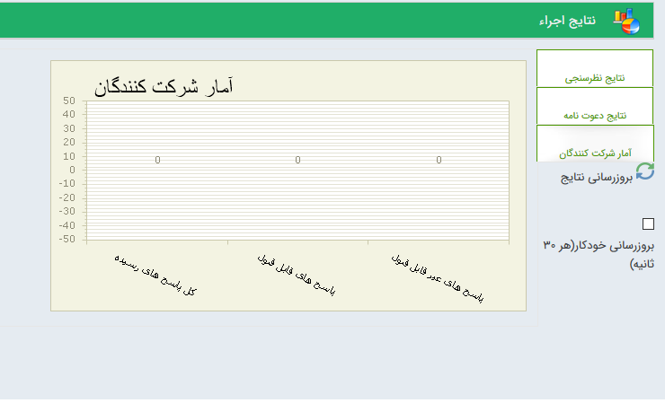
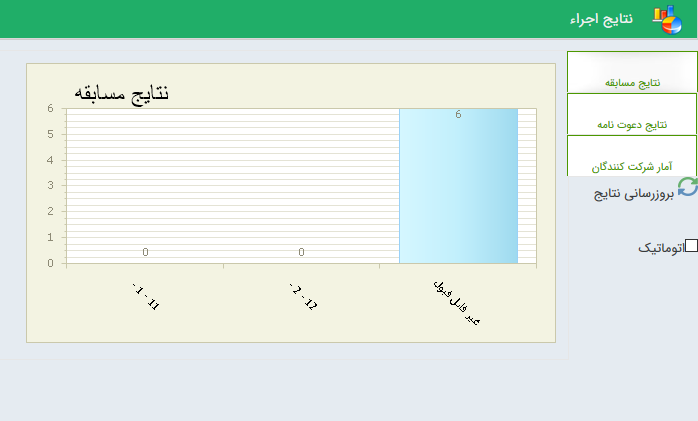

## نمودارهای تحلیلی برنامه تبلیغاتی

>  **مسیرهای دسترسی:**

> **تبلیغات** >**پیام‌کوتاه/ایمیل/فکس** > **مدیریت ارسال گروهی** > **تحلیل نتایج** 

> **تبلیغات** >**پیام‌کوتاه/ایمیل/فکس** > **مدیریت رویداد‌ها/ مدیریت خبرنامه‌ها/ مدیریت نظرسنجی‌ها/ مدیریت مسابقه‌ها** > **بررسی نتایج** 

شامل نمودارهای تحلیلی است که بر اساس نتایج به دست آمده از برنامه اجرا شده، تشکیل و نمایش داده می شوند. این قسمت از سه بخش اطلاعات رویداد تبلیغاتی، اجرای

رویداد تبلیغاتی ونتایج اجرا تکیل شده است.

a.اطلاعات رویداد تبلیغاتی: در این بخش، نوع رسانه، شماره و یا آدرس رسانه، تعداد دفعات تکرار و تعداد مخاطبان ، مشخص می شود.

b.اجرای رویداد تبلیغاتی: در این بخش وضعیت رویداد(تمام شده، درحال اجرا و تازه درج شده ) تعداد دفعات اجرا و تاریخ آخرین ارسال به همراه درصد پیشرفت ارسال ها مشخص می شود.

 c. نتایج اجرا:  

در این قسمت امکان مشاهده نتایج برنامه اجرا شده وجود دارد که به شما کمک می کند درصد موفقیت ، خطا های اجرا و ... را بررسی نمایید تا برنامه های اجرایی موفق تری داشته باشید .

این بخش شامل : اطلاعات کلی ، نسبت های مهم ، خطا ها می باشد

لازم به ذکر است در این راهنما مربوط به برنامه ارسال گروهی و ارسال رویداد میباشد و در رابطه با سایر برنام های اجرایی همچون خبرنامه ، مسابقه و ... در هر قسمت توضیح داده خواهد شد .

نکته : امکان فیلتر برای مشاهده نتایج اجرا براساس تاریخ ارسال وجود دارد که فیلتر شامل نتایج کل اجرا و آخرین تاریخ ارسال می باشد .

خبرنامه : برنامه های خبرنامه به دلیل این که قابلیت عضویت و لغو عضویت مخاطب را دارد در  مشاهده نتایج اجرا امکان بررسی وضعیت عضویت وجود دارد ، که نمایش داده می شود چه تعداد مخاطب عضو و چه چه تعداد مخاطب عضویت خود را لغو کردند

در رابطه با مابقی المان های نتایج اجرا در قسمت نتایج اجرای برنامه ارسال گروه توضیح داده شده است .

نظرسنجی : در برنامه های نظرسنجی نتایج اجرا بصورت نتایج نظرسنجی،نتایج دعوت نامه ، آمارشرکت کنندگان قابل بررسی می باشد .

  در این گزارش می توان مشاهده کرد که از  هر گزینه چه تعداد توسط مخاطبان انتخاب شده است و همچنین چه تعداد پاسخ هایی ارسال شده که شامل این گزینه ها نیست .
  
  
  
  نتایج دعوت نامه :

درصد پوشش= درصد پوشش برای تاکید بر انتخاب شما می باشد و نشان می دهد از تمام مخاطبانی که می توانستید در برنامه تبلیغاتی حاضر شرکت دهید و با رسانه مورد نظر برای آنها پیام ارسال کنید، چه حجمی را انتخاب کرده و در واقع پوشش تبلیغاتی داده اید. حاصل نسبت مخاطبان هدف  به جامعه در دسترس  نشان دهنده میزان مخاطبان پوشش داده شده در یک تبلیغ است.

درصد موفقیت = حاصل نسبت تعداد پیام های رسیده به مخاطبان هدف انتخاب شده نشان دهنده موفقیت ارسال پیام و تحویل به مخاطبان مورد نظر می باشد.

درصداثربخشی : حاصل نسبت مخاطبان پاسخ داده به دریافت کنندگان پیام را نمایش می دهد .

آمارشرکت کنندگان : در این قسمت می توان مشاهده کرد چه تعداد از مخاطبان پاسخ داده اند و چه تعداد از پاسخ ها قابل قبول میباشد یعنی پاسخ ارسالی از میان گزینه تعریف شده است  و چه تعداد از پاسخ ها غیر قابل قبول است یعنی پیام ارسالی در بین گزینه ها نبوده است .

مسابقه :  در برنامه های مسابقه نتایج اجرا بصورت نتایج مسابقه ، نتایج دعوت نامه و آمار شرکت کنندگان قابل بررسی می باشد

 در این قسمت می توان مشاهده کرد که از هر گزینه از مسابقه چه تعداد انتخاب شده است و چه تعداد پاسخ هایی  داده شده در میان گزینه ها وجود ندارد
 
 
 
 
 نتایج دعوت نامه : به نتایج دعوت نامه مراجعه کنید . 

آمارشرکت کنندگان : به آمارشرکت کنندگان مراجعه کنید .

پاسخگو خودکار : در برنامه های پاسخگو خودکار نتایج ارسال شامل  نتایج پاسخگو ، نتایج دعوت نامه ، آمار مراجعان می باشد که امکان بررسی دارند .

نتایج پاسخگو : گزینه های تعریف شده نمایش  داده می شود و می توان مشاهده کرد از هر گزینه چه تعداد توسط مخاطبان انتخاب شده است.

نتایج دعوت نامه :  نتایج دعوت نامه مراجعه کنید  .

آمار مراجعان :  به آمار شرکت کنندگان مراجعه کنید .

[الف - اطلاعات کلی](etelat-koli%2Fetelatkoli.md)   

[ب – نسبت های مهم](advertising-importantbalance%2Fadvertising-importantbalance.md)

[ج – خطاها](advertising-importanterrors%2Fadvertising-importanterrors.md)

[د – پیشنهاد ما](advertising-oursuggestion%2Fadvertising-oursuggestion.md)

