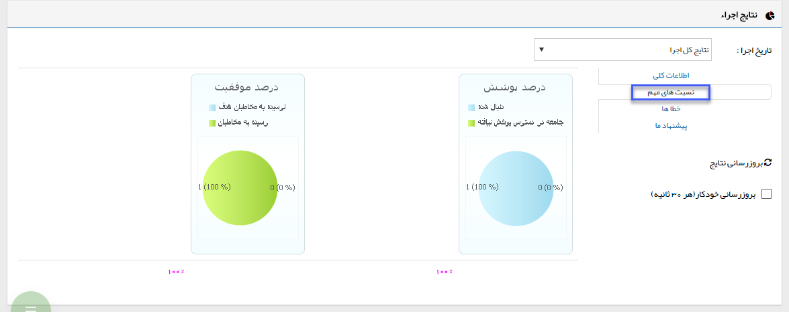
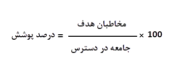

## ب-نسبت های مهم

> مسیر دسترسی:  **تبلیغات** >**پیام‌کوتاه/ایمیل/فکس** > **لیست برنامه‌های تبلیغاتی** > **تحلیل نتایج** > **نسبت‌های مهم** 

1) درصد پوشش= درصد پوشش برای تاکید بر انتخاب شما می باشد و نشان می دهد از تمام مخاطبانی که می توانستید در برنامه تبلیغاتی حاضر شرکت دهید و با رسانه مورد نظر برای آنها پیام ارسال کنید، چه حجمی را انتخاب کرده و در واقع پوشش تبلیغاتی داده اید. حاصل نسبت مخاطبان هدف (ستون 3) به جامعه در دسترس (ستون 2) نشان دهنده میزان مخاطبان پوشش داده شده در یک تبلیغ است.

  

  

2) درصد موفقیت = حاصل نسبت تعداد پیام های رسیده (ستون 5) به مخاطبان هدف انتخاب شده (ستون 3) نشان دهنده موفقیت ارسال پیام و تحویل به مخاطبان مورد نظر می باشد.

