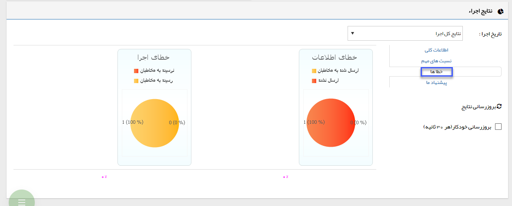

## ج-خطاها

> مسیر دسترسی:  **تبلیغات** >**پیام‌کوتاه/ایمیل/فکس** > **لیست برنامه‌های تبلیغاتی** > **تحلیل نتایج** > **خطاها** 

خطای اطلاعات = به خطایی اشاره دارد که ممکن است بر اثر اطلاعات نادرست در ارتباط با مخاطبان رخ داده باشد. اختلاف تعداد پیام های ارسال شده (ستون 4) نسبت به تعداد مخاطبان هدف (ستون 3) ناشی از همین خطا و تعداد پیام هایی است که ارسال نشده اند. < /

خطای اجرا = به خطایی اشاره می کند که در نتیجه مشکلی از سوی مخاطبان، پیام ارسالی به مخاطب تحویل داده نمی شود. اختلاف تعداد پیام های رسیده به مخاطبان (ستون 5) و تعداد پیام های ارسال شده (ستون 4) که این خطا را ممکن می سازد، می تواند از عواملی مانند مشاهده نکردن ایمیل های تبلیغاتی، خاموش بودن دستگاه فکس یا موبایل و مشکلات مشابه از جانب مخاطب ناشی شود. 

