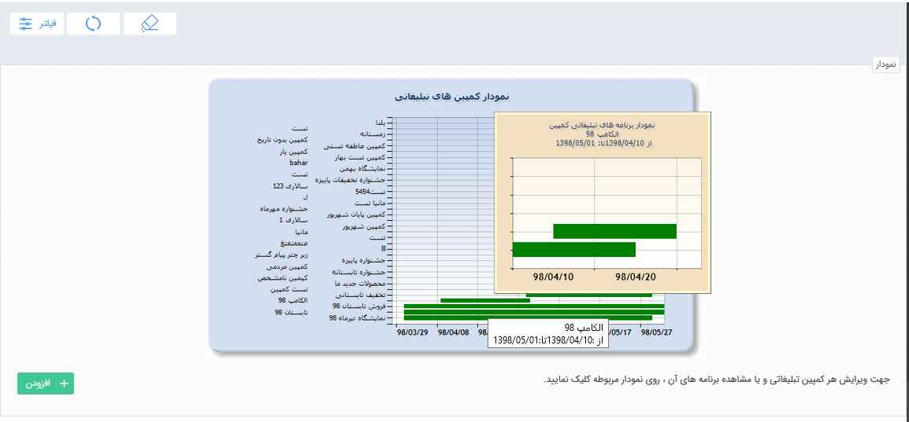
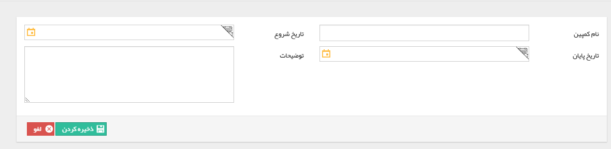
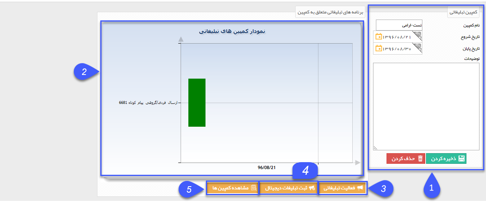
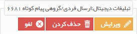


## مدیریت کمپین های تبلیغاتی

> مسیر دسترسی:  **ابزار تبلیغات** >**مدیریت کمپین‌های تبلیغاتی** 

 کمپین تبلیغاتی برای مدیریت بهتر برنامه های تبلیغاتی  و بررسی بهتر نتایج این برنامه ها در نظر گرفته شده است. می توان در این قسمت تمام کمپین هایی که اجرا شده و یا در حال اجرا هستند را مدیریت نمود و بر اساس تاریخ شروع و پایان  و یا نام کمپین فیلتر نمود.  تمام اطلاعات مربوط به کمپین ، برنامه های تبلیغاتی و دیجیتال تعریف شده برای این کمپین را نمایش می دهد .
 
 
 
 تاریخ شروع از/تا : می توان براساس بازه تاریخ شروع  کمپین ، فیلتر مورد نظر را اعمال کرد .

تاریخ پایان از / تا : می توان براساس بازه تاریخ پایان کمپین ، فیلتر مورد نظر را اعمال کرد .

نام کمپین :  می توان براساس نام کمپین فیلتر مورد نظر را اعمال کرد .

نمودار: با نگه داشتن نشانگر موس، می توانید مشخصات هر کمپین مانند تاریخ شروع و پایان آن ، برنامه های تنظیم شده برای آن کمپین را مشاهده نمایید و در صورت کلیک بر روی کمپین مورد نظر در نمودار، وارد تنظیمات آن کمپین خواهید شد.

اضافه کردن:با کلیک بر روی دکمه اضافه کردن پنجره زیر برای شما باز خواهد شد و می توانید کمپین تبلیغاتی و بازه اجرای آن را تعریف کنید .

> نکته: طبق عکس بالا، با نوشتن نام کمپین و تاریخ شروع و پایان، می توانید یک کمپین تعریف نمایید. فیلد توضیحات جهت شرح اطلاعات اولیه و مورد نیاز درباره کمپین تعبیه شده است.

با دوبار کلیک به روی هر کمپین به صفحه تنظیمات آن کمپین طبق تصویر زیر وارد می شوید.

1. اطلاعات : در این قسمت، اطلاعات کمپین مانند تاریخ شروع و پایان و نام آن را مشاهده میکنید.

2.  نمودار برنامه های تبلیغاتی: برنامه های تبلیغاتی که برای این کمپین تعریف شده است بصورت بازه زمانی در این نمودار نمایش داده می شود. و با کلیک بر روی هرکدام، پنجره ای به شکل زیر جهت تدوین برای شما باز میگردد

