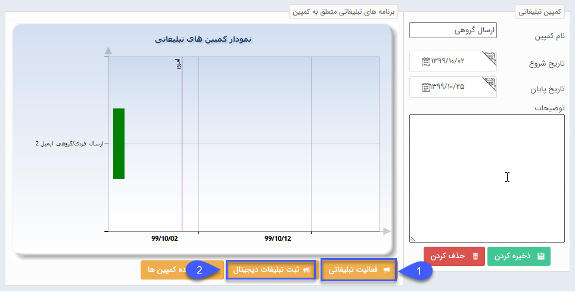

## تعریف برنامه‌های تبلیغاتی

> مسیر دسترسی:  **تبلیغات** >**مدیریت کمپین‌های تبلیغاتی** 

1. فعالیت تبلیغاتی: بازدن این دکمه وارد پنجره تعریف برنامه تبلیغاتی غیر دیجیتال خواهید شد.(منظور از  فعالیت اهای غیر دیجیتال، برنامه های تبلیغاتی است که در پیام گستر انجام و ارسال نمی شوند.)

a.نام فعالیت: در این فیلد نام تبلیغات مورد نظر نوشته می شود.

b.تاریخ شروع/پایان: تاریخ شروع تبلیغ و تاریخ پایان در این فیلدها مشخص میگردد.

c.هزینه برآورد:هزینه ای که بابت تبلیغ داده می شود و یا برآورد می شود که باید داده شود را اینجا یادداشت می کنید.لازم به ذکر است تا سقف 14 رقم امکان تعریف هزینه برآورد وجود دارد.

d.تعداد جامعه هدف: تعداد مخاطبانی که بعنوان هدف شما برای این تبلیغ در نظر گرفته می شود ، در این فیلد مشخص می شود.

e.توضیحات: توضیحات مرتبط با تبلیغ کمپین را در این قسمت بنویسید. (مانند نوع ابزار تبلیغ و نحوه کاربری و اجرای تبلیغ)

4.ثبت تبلیغات دیجیتال: با کلیک بر روی این دکمه، امکان انتخاب یکی از روش های تبلیغات در نرم افزار مانند: پیامک، ایمیل، فکس و چاپ می باشد. پس از انتخاب وارد صفحه مدیریت  همان ابزار تبلیغاتی  جهت تنظیم ارسال(که در بخش[ اطلاعات مشترک ابزار](https://github.com/1stco/PayamGostarDocs/blob/master/help%202.5.4/Marketing/moshtarak-abzar/moshtarak-abzar.md) کامل توضیح داده شده) خواهیم شد.

5. مشاهده کمپین ها:

با استفاده از این کلید به صفحه مدیریت کمپین ها منتقل می شویم .

