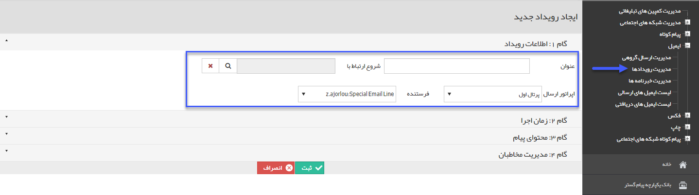

## گام1-اطلاعات رویداد

> مسیر دسترسی:  **تبلیغات** >**ایمیل** > **مدیریت رویدادها** > **ارسال رویداد جدید** > **اطلاعات رویداد** 

به بخش گام اول - اطلاعات پیام در [اطلاعات مشترک بین ابزارها]( http://septadocs.1st.co.com/payamgostar/documents/%D8%A7%D8%B7%D9%84%D8%A7%D8%B9%D8%A7%D8%AA-%D9%85%D8%B4%D8%AA%D8%B1%DA%A9-%D8%A8%DB%8C%D9%86-%D8%A7%D8%A8%D8%B2%D8%A7%D8%B1%D9%87%D8%A7?selectedId=9481e722-68a9-460a-b2d6-57c228705581&menuItemType=1&versionId=a1cb5bd2-9978-4ca7-b9d6-08d951882868) مراجعه کنید.

