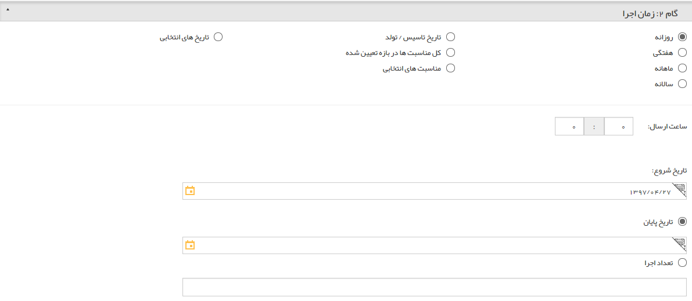

## گام2-زمان اجرا

> مسیر دسترسی:  **تبلیغات** >**ایمیل** > **مدیریت رویدادها** > **ارسال رویداد جدید** > **زمان اجرا رویداد** 

به [گام تنظیم متن](https://github.com/1stco/PayamGostarDocs/blob/master/help2.5.4/Marketing/sms/Advertising-event/2-zaman-bandi/zaman-bandi.md) در رویداد تبلیغاتی پیام کوتاه مراجعه کنید.

