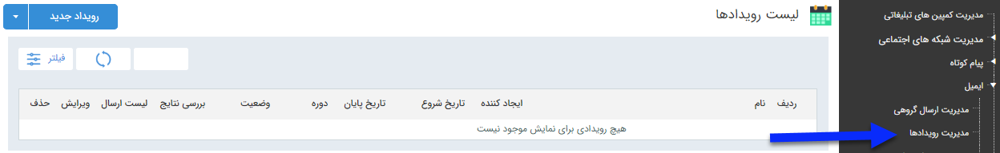

## رویداد تبلیغاتی

> مسیر دسترسی:  **تبلیغات** >**ایمیل** > **مدیریت رویدادها** 

برای ارسال پیام هوشمند در زمانبندهای دقیق و پیشرفته، می توانید از رویداد تبلیغاتی استفاده کنید.

با استفاده از رویداد می توان زمانبندی های مشخصی برای ارسال پیام های متفاوت در نظر گرفت ، برای مثال می توان برای تاریخ هایی که در مدیریت اعیاد و مناسبت ها تعریف شده است پیام های متفاوتی تنظیم کرد تا در همان تاریخ ها برای مخاطبان انتخاب شده ،  ارسال شود . 

 در صفحه اول، می توان با تعیین تاریخ اجرا ، ایجاد کننده رویداد و یا عنوان تعریف شده برای رویداد و زدن دکمه فیلتر، لیست برنامه های اجرا شده در گذشته را مشاهده کرد. اما برای اجرای یک برنامه جدید باید بر روی دکمه " رویداد جدید " در سمت راست و بالای صفحه کلیک کرده و با گذراندن چند گام ساده، برنامه را به راحتی اجرا کرد
 
 لطفا ابتدا<a href="C%3A%2FUsers%2FH.abasi%2FDesktop%2Fhelp%2Fmd%20help%2F%D8%AA%D8%A8%D9%84%DB%8C%D8%BA%D8%A7%D8%AA%2Fmoshtarak-abzar%2Fmoshtarak-abzar.md" target="_blank"> اطلاعات مشترک ابزارها</a>را مطالعه فرمایید و طبق گام های زیر برای ارسال گروهی جدید اقدام فرمایید

 گام 1- [اطلاعات رویداد](https://github.com/1stco/PayamGostarDocs/blob/master/help2.5.4/Marketing/email/Advertising-event-email/1-avalie-roydad-email/1-avalie-roydad-email.md)

گام 2-  [زمان اجرا]( https://github.com/1stco/PayamGostarDocs/blob/master/help2.5.4/Marketing/email/Advertising-event-email/2-zamanbandi-roydad-email/2-zamanbandi-roydad-email.md)

گام 3-  [تنظیم متن](https://github.com/1stco/PayamGostarDocs/blob/master/help2.5.4/Marketing/email/Advertising-event-email/3-matn-roydad-email/3-matn-roydad-email.md)

گام 4-  [انتخاب مخاطبان]( https://github.com/1stco/PayamGostarDocs/blob/master/help2.5.4/Marketing/email/Advertising-event-email/4-mokhatab-roydad-email/4-mokhatab-roydad-email.md)

