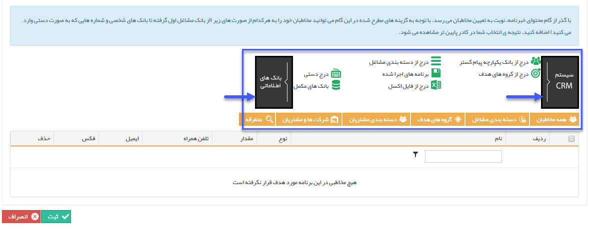

## گام3-انتخاب مخاطبان

> مسیر دسترسی:  **تبلیغات** >**ایمیل** > **مدیریت خبرنامه‌ها** > **ارسال خبرنامه جدید** > **مدیریت مخاطبان خبرنامه** 

برای اطلاعات بیشتر به<a href="C%3A%2FUsers%2FH.abasi%2FDesktop%2Fhelp%2Fmd%20help%2F%D8%AA%D8%A8%D9%84%DB%8C%D8%BA%D8%A7%D8%AA%2Fmoshtarak-abzar%2Fgam%20se%2Fselect-Audience.md" target="_blank"> لینک انتخاب مخاطبان </a>در برنامه پیام کوتاه مراجعه نمایید.

این مخاطبان باید شامل پروفایل هایی باشند که آدرس ایمیل در آن ها وجود داشته باشد .

