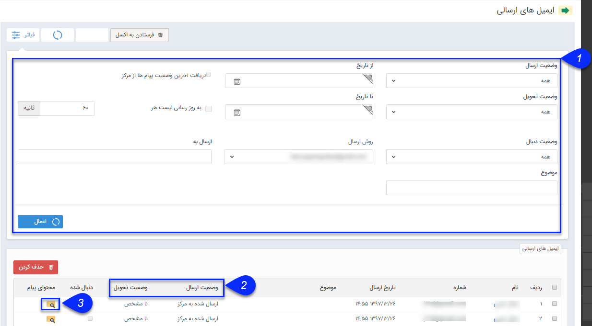

## لیست ایمیل ‌های ارسالی

> مسیر دسترسی:  **تبلیغات** >**ایمیل** > **لیست ارسال**

 از طریق این صفحه می توانید  تمام ایمیل های ارسالی خود را مشاهده کنید. تاریخ ارسال، روش ارسال، وضعیت ارسال، وضعیت تحویل و وضعیت دنبال فاکتورهایی هستند که می توانید بر اساس آن ها لیست ایمیل ها را محدود نمایید.

> نکته: برای اطلاعات بیشتر در خصوص لیست ارسال ها به قسمت  [اطلاعات مشترک لیست ارسال](https://github.com/1stco/PayamGostarDocs/blob/master/help2.5.4/Marketing/sms/Send-ist/moshtarake-liste-ersal.md) مراجعه کنید.

1. درقسمت فیلتر ها، با توجه فیلدهای مشخص شده می توانید می توانید، دامنه نمایش ایمیل ها را محدود کنید.

2. وضعیت ارسال و وضعیت تحویل می توانند به شما در نتیجه ایمیل های ارسالی کمک نمایند .

3. در ستون محتوای پیام، می توانید، متن پیام ارسالی خودر را ببینید.

