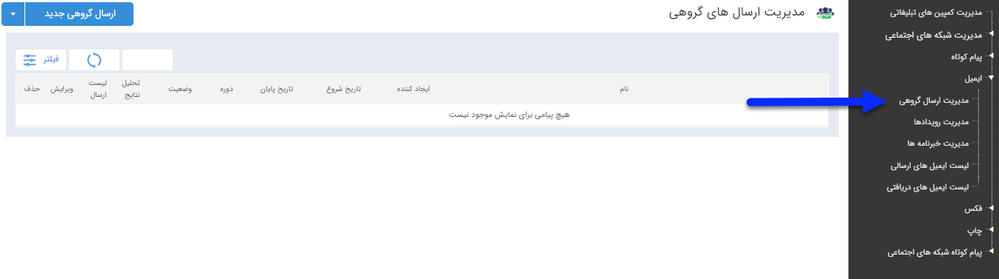

## مدیریت ارسال گروهی

> مسیر دسترسی:  **تبلیغات** >**ایمیل** > **مدیریت ارسال گروهی** 

با استفاده از این قابلیت امکان تعریف برنامه های گروهی برای ارسال پیام به گروه و یا دسته ای ار مخاطبان فراهم می شود در صفحه اول، می توان لیست برنامه های تنظیم شده را مشاهده کرد که با استفاده از فیلتر های مختلف می توان به برنامه مورد نظر دسترسی پیدا کرد .

 اما برای اجرای یک برنامه جدید باید بر روی دکمه " ارسال گروهی جدید " در سمت راست و بالای صفحه کلیک کرده و با گذراندن چند گام ساده، برنامه را به راحتی اجرا کرد .
 
 لطفا ابتدا [اطلاعات مشترک بین ابزارها]( http://septadocs.1st.co.com/payamgostar/documents/%D8%A7%D8%B7%D9%84%D8%A7%D8%B9%D8%A7%D8%AA-%D9%85%D8%B4%D8%AA%D8%B1%DA%A9-%D8%A8%DB%8C%D9%86-%D8%A7%D8%A8%D8%B2%D8%A7%D8%B1%D9%87%D8%A7?selectedId=9481e722-68a9-460a-b2d6-57c228705581&menuItemType=1&versionId=a1cb5bd2-9978-4ca7-b9d6-08d951882868) را مطالعه فرمایید و طبق گام های زیر برای ارسال گروهی جدید اقدام فرمایید

 گام 1- [اطلاعات اولیه ارسال گروهی](https://github.com/1stco/PayamGostarDocs/blob/master/help2.5.4/Marketing/email/Advertising-event-email/1-avalie-roydad-email/1-avalie-roydad-email.md)

گام 2-  [تنظیم متن]( https://github.com/1stco/PayamGostarDocs/blob/master/help2.5.4/Marketing/email/send-group-email/2-tanzim-matn-email/2-tanzim-matn-email.md)

گام 3-  [انتخاب مخاطبان]( https://github.com/1stco/PayamGostarDocs/blob/master/help2.5.4/Marketing/email/send-group-email/3-mokhatab-email/3-mokhatab-email.md)

