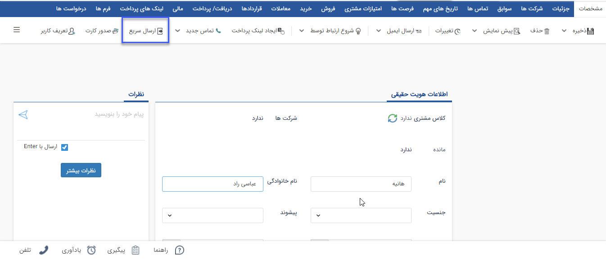
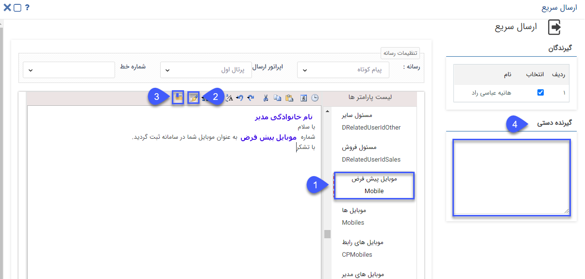

## ارسال سریع

> مسیر دسترسی:  **بانک یکپارچه** >**بانک اطلاعاتی** > **پروفایل هویت** > **ارسال سریع** 

در صفحه‌ی اصلی هویت‌ها امکان ارسال پیام به هویت، از طریق کلید ارسال سریع وجود دارد.

با استفاده از این بخش صفحه‌ی ارسال سریع در دسترس قرار می‌گیرد، با انتخاب رسانه (پیام کوتاه، ایمیل، فکس و چاپ) و خط  در بخش تنظیمات رسانه و تنظیم متن ارسالی می‌توان پیام موردنظر را به هویت ارسال کرد.

1. **پارامتر هوشمند:** برای تنظیم متن پیام میتوان از پارامترهای هوشمند استفاده کرد. برای استفاده از پارامتر هوشمند باید دو بار بر روی آن کلیک کرد. (برای مطالعه بیشتر به بخش [متن هوشمند](https://github.com/1stco/PayamGostarDocs/blob/master/help%202.5.4/Marketing/matn-hoshmand/matn-hoshmand.md) مراجعه کنید.)

2. **درج امضا:** با کلیک بر روی آیکون قلم می توانید امضای جدیدی را ایجاد کنید و یا از امضاهایی که قبلا برای خود ایجاد نموده اید استفاده کنید. (برای مطالعه بیشتر به بخش [اضافه کردن امضا](https://github.com/1stco/PayamGostarDocs/blob/master/help%202.5.4/Marketing/moshtarak-abzar/gam%20do/add-a-signature/add-a-sign.md) مراجعه کنید.)

3. **انتخاب از قالب‌ها:** با کلیک بر روی آیکون فولدر در نوار ابزار متن می توانید از قالب های تعریف شده ی قبلی ( تعریف شده در مدیریت پیام های الگو و یا تعریف شده توسط کلید افزودن در این قسمت ) استفاده کرده و با متنی را از یک فایل در ج نمایید.  (برای مطالعه بیشتر به بخش [انتخاب قالب پیام](https://github.com/1stco/PayamGostarDocs/blob/master/help%202.5.4/Marketing/moshtarak-abzar/gam%20do/ghaleb-payam/ghaleb-payam.md) مراجعه کنید.) 

4. **گیرندگان دستی:** در بخش گیرندگان دستی امکان اضافه کردن شماره موبایل، ایمیل، شماره فکس برای ارسال پیام به مخاطبان دیگر وجود دارد.

