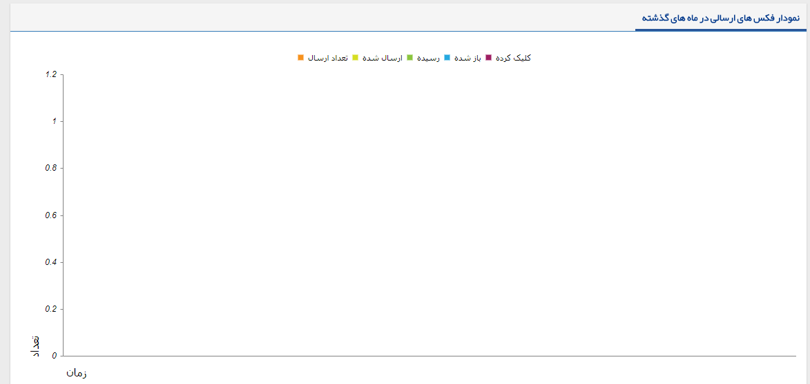

## فکس

> مسیر دسترسی:  **تبلیغات** >**فکس** 

در این بخش امکان مشاهده گزارش از ارسال پیام ها، بصورت نموداری می باشد که شامل دو نمودار می باشد :

نمودار فکس های ارسالی در ماه های گذشته :  بصورت خودکار سه ماه گذشته نمایش داده می شود ، که در هر کدام از این ماه ها چه تعداد فکس  ارسال شده و چه تعداد به مخاطب رسیده است .  

نمودار فکس های ارسالی در 90 روز گذشته:  در این قسمت گزارش نموداری ارسال پیام ها در 90 روز گذشته نمایش داده می شود ، که در هر روز چه تعداد فکس  ارسال شده و چه تعداد فکس رسیده به مخاطب داشتیم . 

[مدیریت ارسال گروهی]( https://github.com/1stco/PayamGostarDocs/blob/master/help2.5.4/Marketing/fax/group-sending-fax/group-sending-fax.md)

[لیست فکس‌های ارسالی](https://github.com/1stco/PayamGostarDocs/blob/master/help2.5.4/Marketing/fax/send-list-fax/send-list-fax.md)

[لیست فکس‌های دریافتی]( https://github.com/1stco/PayamGostarDocs/blob/master/help2.5.4/Marketing/fax/resive-list-fax/resive-list-fax.md)

در صورت داشتن ماژول فکس هوشمند می توانید از  قابلیت ارسال فکس بصورت تکی و گروهی در پیام گستر استفاده نمایید .

برای استفاده از  قابلیت برنامه های تبلیغاتی  ایمیل کاربر نیاز به مجوز ارسال فکس دارد .

 
 
 
 
