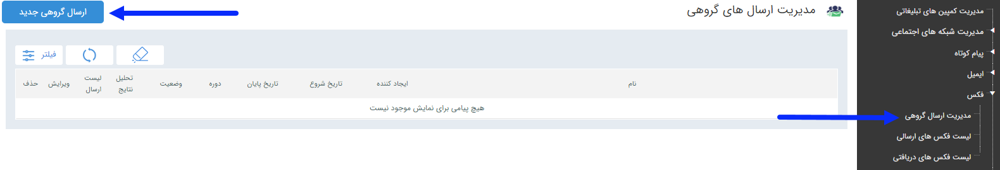

## مدیریت ارسال گروهی

> مسیر دسترسی:  **تبلیغات** >**فکس** > **مدیریت ارسال گروهی فکس**

با استفاده از این قابلیت امکان تعریف برنامه های گروهی برای ارسال پیام به گروه و یا دسته ای ار مخاطبان فراهم می شود در صفحه اول، می توان لیست برنامه های تنظیم شده را مشاهده کرد که با استفاده از فیلتر های مختلف می توان به برنامه مورد نظر دسترسی پیدا کرد .

 اما برای اجرای یک برنامه جدید باید بر روی دکمه " ارسال گروهی جدید " در سمت راست و بالای صفحه کلیک کرده و با گذراندن چند گام ساده، برنامه را به راحتی اجرا کرد .
 
گام اول - [اطلاعات اولیه]( https://github.com/1stco/PayamGostarDocs/blob/master/help2.5.4/Marketing/print/group-sending-print/1-avalie-print/1-avalie-print.md)

گام دوم- [محتوای پیام](https://github.com/1stco/PayamGostarDocs/blob/master/help2.5.4/Marketing/print/group-sending-print/2-tanzimmatn-print/2-tanzimmatn-print.md)

گام سوم- [انتخاب مخاطبان](https://github.com/1stco/PayamGostarDocs/blob/master/help2.5.4/Marketing/print/group-sending-print/3-mokhatab-print/3-mokhatab-print.md)

