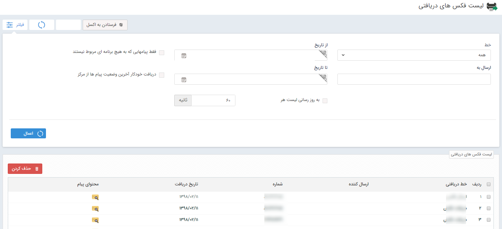

## لیست فکس های دریافتی

> مسیر دسترسی:  **تبلیغات** >**فکس** > **لیست دریافت** 

از طریق پنجره زیر می توانید لیست فکس هایی که برای شما ارسال شده است شماره خطی که فکس از آن برای شما ارسال شده به همراه تاریخ دریافت آن مشاهده نمایید و همچنین محتوای فکس دریافت شده را می توانید با استفاده از  ستون محتوای پیام مشاهده نمایید .

