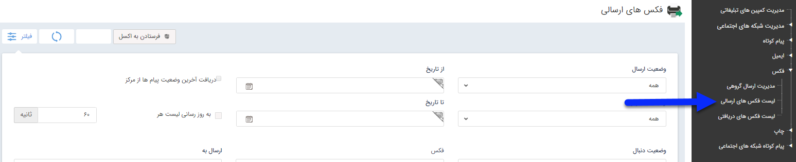

## لیست فکس های ارسالی 

در این صفحه می توانید لیست تمام فکس های ارسالی خود را مشاهده کنید . تاریخ ارسال، وضعیت ارسال و تحویل و ... فاکتورهایی هستند که می توانید بر اساس آن ها لیست فکس را محدود نمایید. همچنین محتوای فکس ارسال شده را می توانید با از ستون محتوای پیام استفاده کنید .

> نکته: برای اطلاعات بیشتر در خصوص لیست ارسال ها به قسمت [اطلاعات مشترک لیست ارسال پیام](https://github.com/1stco/PayamGostarDocs/blob/master/help2.5.4/Marketing/sms/Send-ist/moshtarake-liste-ersal.md
)
 مراجعه کنید.

