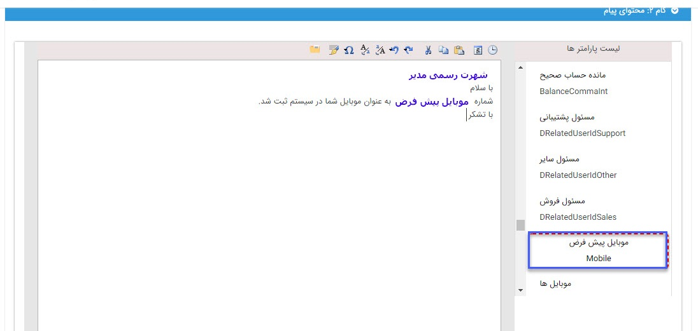

## متن هوشمند

برای اینکه هرکدام از مخاطبان شما مشخصات دقیق خودشان را در متن ارسالی شما ببیند و اثربخشی و اعتماد به پیام شما بیشتر شود، از متن هوشمند استفاده کنید. در جای خالی، متن خود را بنویسید و هر جا که نیاز به استفاده از مشخصات مخاطب خود دارید، از ستون سمت راست روی هر مورد که لازم می دانید، دوبار کلیک کنید تا در متن شما وارد شده و پس از اجرای برنامه با محتوای منطبق با هر هویت برای وی ارسال شود.

برای مثال در شکل زیر متنی که مخاطبان پیام دریافت می کنند به جای پارامتر "نام کامل  مدیر " آنچه دریافت می کنند " جناب آقای+نام+نام خانوادگی" و در صورت مونث بودن مخاطب"سرکار خانم+نام+نام خانوادگی" است.

  
انتخاب از لیست پارامترها: جهت استفاده از پارامترهای هوشمند در متن خودکافی است روی آن ها دوبار کلیک نمایید.

> نکته :  لازم به ذکر است برای استفاده از پارامتر هایی که باید بصورت لینک نمایش داده شود برای مثال لینک ویرایش، آدرس ویرایش پروفایل و ... باید طبق دستور زیر در بخش html وارد گردد .

