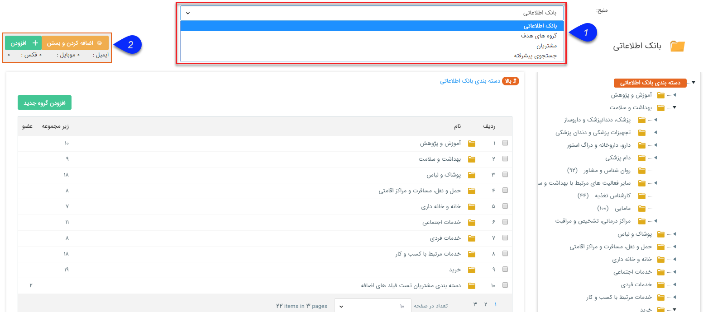
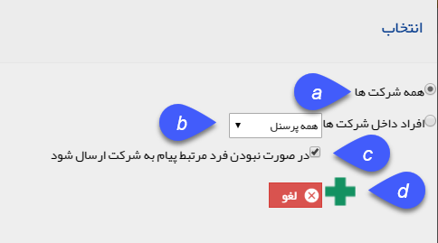

## بانک یکپارچه

> مسیر دسترسی:  **تبلیغات** >**پیام‌کوتاه/ایمیل/فکس/پرینت** > **برنامه‌های ارسال پیام** > **مدیریت مخاطبان** > **درج از بانک یکپارچه‌ی پیام‌گستر** 

از این صفحه می توانید به تمام مخاطبان بانک اطلاعاتی، دسترسی پیدا کنید. کافی است با تغییر منبع، به اطلاعات موردنیاز خود در هر بخش دسترسی داشته باشید.

در مورد انتخاب از دسته بندی ها تنها قادر خواهید بود دسته بندی های سطح آخر را انتخاب نمایید. البته امکان انتخاب همزمان چند دسته بندی برای شما وجود دارد. کافی است با کشیدن کلیک موس بر روی تعدادی از دسته بندی ها آن ها را انتخاب کرده و دکمه اضافه کردن را کلیک نمایید.

1. منبع:  امکان انتخاب مخاطبان از بخش های مختلف بانک وجود دارد.

اگر که هویت و یا هویت های انتخاب شده از نوع حقوقی باشند هنگام انتخاب می شود مشخص کرد که پیام تنظیم شده برای چه کسی ارسال شود .

a. خود شرکت به فهرست اضافه می گردد.

b. می توانید یک رده شغلی (برای مثال مدیرعامل) را برای اضافه شدن به لیست ارسال انتخاب نمایید.

c. با فعال بودن این گزینه در صورتی که مخاطب مورد نظر کارمندی با رده شغلی انتخاب شده را نداشته باشد، فردی که به عنوان رابط تعیین شده است به لیست ارسال اضافه می گردد.

d.با زدن این دکمه، مخاطبان به لیست شما اضافه خواهند شد.

2.افزودن به لیست: در این قسمت، مخاطبان انتخاب شده، به لیست ارسال اضافهه می گردند.

در کادر نارنجی رنگ زیر دکمه اضافه کردن نمایش داده می شود که از مخاطبان انتخاب شده چه تعداد از چه  رسانه هایی در دسترس می باشد..

 منبع جستجوی پیشرفته به صورت دقیق تر جستجو نمایید.