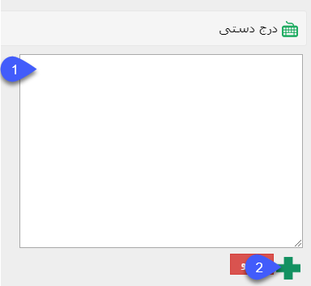

## درج دستی

> مسیر دسترسی:  **تبلیغات** >**پیام‌کوتاه/ایمیل/فکس/پرینت** > **برنامه‌های ارسال پیام** > **مدیریت مخاطبان** > **درج دستی** 

1. باید شمارها و یا آدرس های ایمیل را به صورت دستی زیر هم زیر هم وارد نمود.( از  این روش برای تعداد ارسال پایین در لحظه ارسال می شود .)

2. پس از درج شماره ها بصورت دستی، با زدن دکمه بعلاوه، شماره ها و آدرس های ایمیل به لیست ارسال افزوده خواهد شد.

