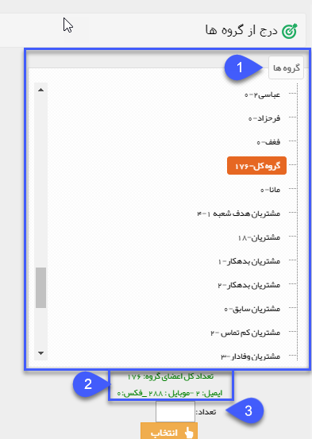

## گروه های هدف

> مسیر دسترسی:  **تبلیغات** >**پیام‌کوتاه/ایمیل/فکس/پرینت** > **برنامه‌های ارسال پیام** > **مدیریت مخاطبان** > **گروه‌های هدف** 

انتخاب از بین مخاطبانی که در قسمت گروه های هدف ، گروه بندی شده اند.

1. در این مرحله تنها می توانید دسته بندی های سطح آخر در گروه را نتخاب نمایید.

2.  با انتخاب یک دسته بندی تعداد رسانه موجود در آن را در پایین صفحه نمایش می دهد .

3. می توانید تعداد موردنظر خود را در کادر تعداد وارد نمایید تا به صورت تصادفی به تعدادی از مخاطبان ارسال شود و در نهایت با زدن دکمه انتخاب، مخاطبان به لیست ارسال افزوده خواهند شد . 

