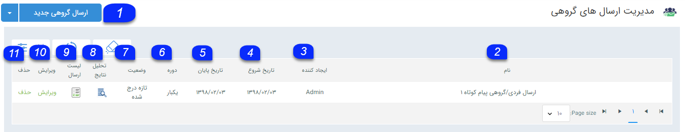
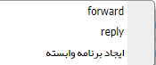

## اطلاعات مشترک بین ابزار ها

> مسیر دسترسی:  **تبلیغات** >**پیام‌کوتاه/ایمیل/فکس/پرینت** 

بدون در نظر گرفتن رسانه ارسال(پیام کوتاه، فکس، ایمیل)، هر برنامه تبلیغاتی شامل 3 مرحله یکسان می شود. (البته برنامه هایی مانند نظرسنجی و پاسخگو و ... دارای مراحل خاص دیگری نیز هستند.)

این 3 مرحله به ترتیب زیر می باشد.

 گام 1- [اطلاعات پیام](https://github.com/1stco/PayamGostarDocs/blob/master/help2.5.4/Marketing/moshtarak-abzar/gam-yk/gam-yk.md)

گام 2-  [محتوی پیام](https://github.com/1stco/PayamGostarDocs/blob/master/help2.5.4/Marketing/moshtarak-abzar/gam-do/gam-do.md)

گام 3-  [انتخاب مخاطبان]( https://github.com/1stco/PayamGostarDocs/blob/master/help2.5.4/Marketing/email/Advertising-event-email/3-matn-roydad-email/3-matn-roydad-email.md)

نکته: قبل از اجرای انبوه، پیام تنظیم شده را یک بار برای خود ارسال نمایید تا بتوانید از صحت اجرای برنامه اطمینان حاصل نمایید.

پس از اجرای هر برنامه:

بعد از اجرای هر برنامه در صفحه مدیریت انواع ارسال ها در لیست برنامه ها ، می توانید برنامه ایجاد شده  را مانند تصویر مشاهده نمایید که در لیست برنامه قرار گرفته شده است. (در اینجا لیست ارسال گروهی در نظر گرفته شده است)

1. ارسال گروهی جدید: میتوانید یک ارسال گروهی جدید را آغاز کنید.

2. نام: عنوانی که برای ارسال انتخاب شده را نمایش میدهد.

3. ایجادکننده: کاربر ایجاد کننده ارسال گروهی را نمایش میدهد.

4. تاریخ شروع: تاریخ شروعی که برای ارسال در نظر گرفته شده را نمایش میدهد.

5. تاریخ پایان: تاریخ پایان ارسال را نمایش میدهد.

6.  دوره :  دوره ی اجرا  برنامه ارسال نمایش داده می شود. برای مثال  در ارسال رویداد ممکن است برنامه تنظمی شده روزانه باشد  در این صورت در این قسمت نمایش داده می شود که روزانه است .

7. وضعیت: قسمت اطلاعات مشترک لیست ارسال پیام را مطالعه کنید.

8. تحلیل نتایج: نتایج مرتبط با این ارسال را می توانید مشاهده کنید.

9. لیست ارسال: می توانید  وضعیت ارسال برای هرکدام از مخاطبان  این برنامه را مشاهده کنید.(برنامه هایی که قابلیت دریافت دارند مثل نظرسجی،مسابقه و ... در این قسمت لیست ارسال و دریافت را دارند که با مشاهده آن می شود مشخص کرد که می خواهد لیست ارسال مربوط به این برنامه مشاهده شود یا لیست دریافت )

10. ویرایش: تنها برنامه هایی قابلیت ویرایش دارند که وضعیت آن ها تازه درج  و یا در حال اجرا می باشد.  برنامه های در حال اجرا از زمان ویراش به بعد بصورت ویرایش شده عمل می کند .

11. حذف: در صورتی که برنامه تازه درج شده  و یا در حال اجرا باشد حذف شود، ارسالی صورت نمی گیرد ولی در صورتی که وضعیت برنامه تمام شده باشد و برنامه را حذف نمایید، برنامه اجرا شده است و با حذف آن تنها نتایج برنامه را مشاهده نمی کنید.

کلیک راست:  در ارسال گروهی راست کلیک بر روی یک برنامه شامل موارد زیر می باشد :

Forward: اجرای این برنامه با مخاطبان جدید

Reply: اجرای برنامه جدید به مخاطبان این برنامه

 ایجاد برنامه وابسته : برنامه ی مرتبط با یک برنامه، برنامه ای است با تنظیمات و مخاطبان جدیدی نسبت به برنامه قبلی.

تصور کنید که گروه و یا دسته ای را به عنوان مخاطبان یک برنامه انتخاب کرده اید و به تمام اعضای گروه پیامی را ارسال کرده اید. در هفته های آینده تعداد جدیدی مخاطب به دسته بندی موردنظر افزوده شده است و شما می خواهید همان پیام به آن ها ارسال شود، به جای اجرای یک برنامه جدید می توانید برنامه مرتبط با آن برنامه را اجرا نمایید، منتها در این برنامه تنها به مخاطبانی ارسال صورت می گیرد که در برنامه قبلی حضور نداشتند. (بدون ارسال تکراری ها )

یا تصور نمایید دسته ای را به عنوان مخاطبان یک برنامه انتخاب کرده اید و تعدادی از آن ها را به صورت تصادفی انتخاب می کنید و برنامه ای اجرا می شود. درروزهای آینده می توانید برنامه مرتبطی را اجرا کنید که مخاطبان تصادفی برنامه قبل در این برنامه مرتبط وجود نداشته باشد.)

یعنی این بصورتی کار می کند که هویت هایی که قبلا ارسال شده  ارسال انجام نمیشود و به هویت هایی که در اون گروه هستن و ارسالی بهشون انجام نشده ارسال می شود .

