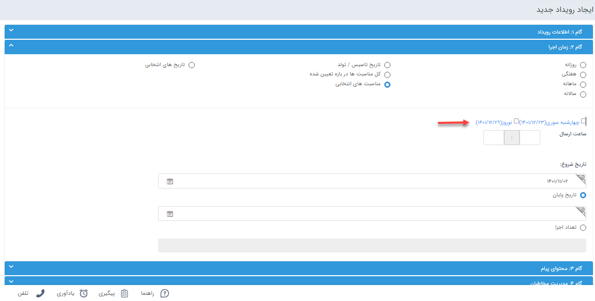

# گام 2 -  زمان اجرا رویداد تبلیغاتی پیامک 

**در این گام، سه نوع زمان بندی برای اجرای برنامه پیشنهاد می شود:**

1. **زمان‌بندی دوره‌ای** 
   با انتخاب گزینه‌های روزانه، هفتگی، ماهانه و سالیانه می‌توانید نحوه ارسال پیام را تعیین کنید. با انتخاب هر کدام از گزینه‌ها به دو صورت امکان تعیین بازه زمانی وجود دارد: 
   - زمان **شروع** و **پایان** رویداد را تعیین کنید.
   - زمان **شروع** و **دفعات ارسال پیام** را تعیین کنید.
2. **تاریخ تأسیس/تولد** 
   با انتخاب این گزینه رویداد پیامکی شما برای هویت‌های حقوقی براساس **تاریخ تاسیس** و برای هویت‌های حقیقی، براساس **تاریخ تولد** که در پروفایل آن‌ها وارد کرده‌اید، اجرا خواهد شد.
3. **کل مناسبت‌ها در بازه تعیین شده** 
   تمامی مناسبت‌هایی که در بخش اعیاد و مناسبت‌ها تعیین کرده‌اید را در این قسمت نمایش داده و این این برنامه را برای همه‌ی آن مناسبت‌ها اجرا می‌کند.

> **نکته** 
> اگر در [مدیریت اعیاد و مناسبت‌ها](https://github.com/1stco/PayamGostarDocs/blob/master/help%202.5.4/Basic-Information/Holiday-management-and-occasions/Holiday-management-and-occasions.md) برای مناسبت‌های تعریف شده پیامی تنظیم شده باشد ، زمانی که تاریخ مورد نظر انتخاب شود برای ارسال رویداد، متن پیام تعریف شده نمایش داده خواهد شد که می‌توانید متن آن را ویرایش کرده و در برنامه استفاده نمایید.
 
4. **مناسبت‌های انتخابی** 
   در این حالت لیست تمامی مناسبت‌هایی که در بخش [مدیریت اعیاد و مناسبت‌ها]() تعیین کرده‌اید را نمایش داده ولی چک باکس همه‌ی آن‌ها انتخاب شده نیست و می‌توانید هرکدام از آن مناسبت‌ها را برای رویداد خود انتخاب نمایید.

   
5. **تاریخ‌های انتخابی** 
   با انتخاب این گزینه، بدون هیچ محدودیتی در این مرحله می‌توانید ساعت و تاریخ شروع و پایان رویداد را مشخص کنید (دیگر در این‌جا تعداد اجرا معنایی ندارد) 
   از طرفی در مرحله سوم -محتوای پیام- امکان گزینه **چند متنی** برای شما فعال شده که می‌توانید برای رویداد خود **تاریخ‌های مختلف** تعیین کرده و یا از **لیست مناسبت‌ها** یک یا چند مناسبت را انتخاب نمایید.

> **نکته** 
>  در ارسال گروهی **مدیریت رویداد** و **خبرنامه** در صورت اینکه در روز یکبار لیست ارسال تشکیل و پیام ارسال شده باشد و بخواهید تنظیمات آن را ویرایش کنید، در ان روز مجددا ارسال نمیشود و این تغییرات برای ارسال فردا اعمال میشود .اما اگر قبل از تشکیل لیست ارسال یعنی قبل از اجرا و ساعت آن رویداد و خبرنامه، تغییرات اعمال می‌شود.

