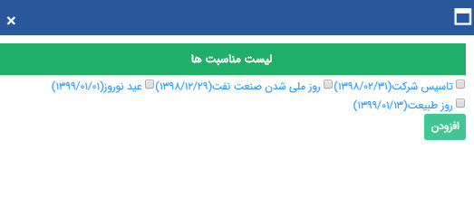

## گام3-تنظیم متن

> مسیر دسترسی:  **تبلیغات** >**پیام‌کوتاه** > **مدیریت رویدادها** > **ارسال رویداد جدید** > **محتوای پیام رویداد** 

  لطفا ابتدا به [گام دوم - محتوای پیام](https://github.com/1stco/PayamGostarDocs/blob/master/help%202.5.4/Marketing/moshtarak-abzar/gam%20do/gam-do.md) در اطلاعات مشترک ابزارها مراجعه کنید.

 
 1. حالت رویداد: در حالت تک متنی برای کلیه تاریخ های انتخابی فقط یک متن ارسال می شود و در حالت چند متنی می توانید برای هر تاریخ یک متن مشخص را ویرایش نمایید.
 
 
 
 1.حالت پیام ارسالی  :  در حالت تک متنی برای کلیه تاریخ های انتخابی فقط یک متن ارسال می شود و در حالت چند متنی می توانید برای هر تاریخ یک متن مشخص تنظیم نمایید .

> نکته : انتخاب حالت چند متنی فقط زمانی در دسترس می باشد که زمان اجرا روی تاریخ های انتخابی باشد .

هنگامی که زمان اجرا روی مناسبت های انتخابی باشد حالت چند متنی قابل انتخاب نیست اما میشود در کنار کادر متنی، هر تاریخ را تک به تک انتخاب نمود و متن مربوط به آن را تنظیم کرد .

2. لیست تاریخ ها: تاریخ های انتخاب شده را نمایش می دهد و با کلیک بر روی هرکدام می توانید پیامی بخصوصی که قرار است در آن تاریخ ارسال شود را مشخص نمایید.

3. افزودن از لیست اعیاد: میتوانید یکی از اعیادی که در بازه زمانی شروع و پایان انتخاب شده قرار گرفته اند را انتخاب کنید.

4. افزودن تاریخ دستی:  میتوانید تاریخ های مورد نظر را بصورت دستی وارد لیست تاریخ ها کنید.

.png)

5. لیست پارامترها: از بین پارامترهای هوشمند، میتوانید پارامترهای متغیر در هر مخاطب را انتخاب و با دوبار کلیک آن را به متن پیام اضافه نمایید.

6. متن پیام: میتوانید متن پیام رویداد را در اینجا بنویسید.

