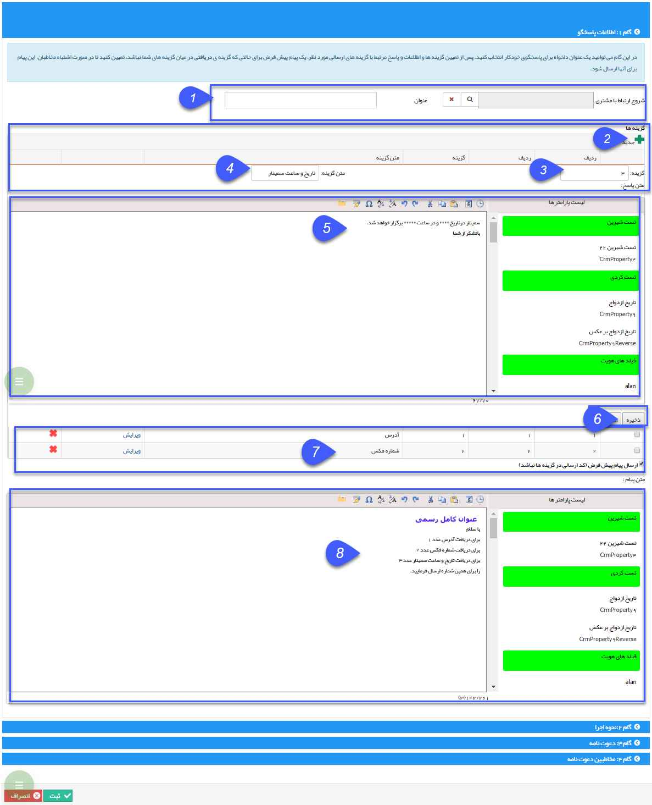

## گام1-اطلاعات اولیه پاسخگو خودکار

> مسیر دسترسی:  **تبلیغات** >**پیام‌کوتاه** > **مدیریت پاسخگو خودکار** > **پاسخگو خودکار جدید** > **اطلاعات پاسخگو خودکار** 

1. عنوان/شروع ارتباط: عنوان مورد نظر برای این برنامه باید تعریف شود  . در صورت تمایل، می توان کمپین تبلیغاتی مشخصی را به این پاسخگو خودکار متصل کرد تا تعداد پیام های ارسالی در هزینه های آن کمپین محاسبه گردد.

2. گزینه جدید: برای ایجاد گزینه ها باید از گزینه جدید استفاده کرد .

3. تعیین شماره: در این فیلد شماره گزینه ها تعریف می گردد ، که مخاطب قرار است به عنوان انتخاب خود ارسال نماید. برای مثال "1"

4. متن گزینه: در این قسمت، عنوان گزینه انتخاب می شود. برای مثال "شماره فکس"

5. تعیین پاسخ های مناسب: متن هر گزینه برای ارسال در اینجا انتخاب میشود، برای مثال "شماره فکس شرکت 02144444444 می باشد، با تشکر از  شما"

6. ذخیره: گزینه مورد نظر را ذخیره می کند.

7. در این قسمت گزینه های ساخته شده بصورت یک لیست نمایش داده می شوند.

8. پیام پیش فرض: می شود مشخص کرد هنگامی که مخاطب عددی بغیر از ، گزینه های تعیین شده ارسال کند ، متن تعریف شده در این قسمت  برایش ارسال شود .

