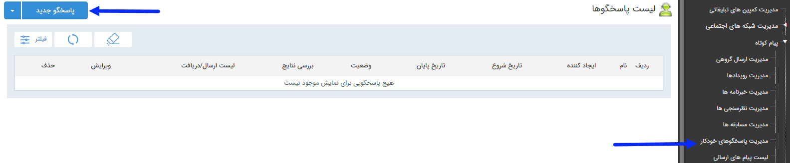

## پاسخگو خودکار

> مسیر دسترسی:  **تبلیغات** >**پیام‌کوتاه** > **مدیریت پاسخگو خودکار** 

برای ارسال خودکار اطلاعات به مخاطب مانند آدرس، شماره فکس و .... می توانید از این آیتم تبلیغات استفاده کنید.

این قابلیت به این صورت می باشد که باید گزینه و اطلاعات مورد نظر برای ارسال تعریف می شود و مخاطب با ارسال هر کدام از گزینه های مورد نظر اطلاعات مربوط به آن گزینه را دریافت می کند . 

در صفحه اول، می توان با تعیین تاریخ اجرا و زدن دکمه فیلتر، لیست برنامه های اجرا شده در گذشته را مشاهده کرد. اما برای اجرای یک برنامه جدید باید بر روی دکمه "پاسخگوی جدید" در سمت راست و بالای صفحه کلیک کرده و با گذراندن چند گام ساده، برنامه را به راحتی اجرا کرد .

لطفا ابتدا [اطلاعات مشترک بین ابزارها](https://github.com/1stco/PayamGostarDocs/blob/master/help2.5.4/Marketing/moshtarak-abzar/moshtarak-abzar.md) را مطالعه فرمایید و طبق گام های زیر برای ارسال گروهی جدید اقدام فرمایید.

 گام 1- [اطلاعات پاسخگو](https://github.com/1stco/PayamGostarDocs/blob/master/help2.5.4/Marketing/sms/Autoresponder/1-avalie-khodkar/1-avalie-khodkar.md)

گام 2-  [نحوه اجرا](https://github.com/1stco/PayamGostarDocs/blob/master/help2.5.4/Marketing/sms/Autoresponder/2-nahveejra-khodkar/2-nahveejra-pasokh-khodkar.md)

گام 3-  [دعوتنامه](https://github.com/1stco/PayamGostarDocs/blob/master/help2.5.4/Marketing/sms/Autoresponder/3-davatname-pasokh-khodkar/3-davatname-pasokh-khodkar.md)

گام 4-  [مخاطبین دعوتنامه](https://github.com/1stco/PayamGostarDocs/blob/master/help2.5.4/Marketing/sms/Autoresponder/4-mokhatab-pasokh-khodkar/4-mokhatab-pasokh-khodkar.md)

