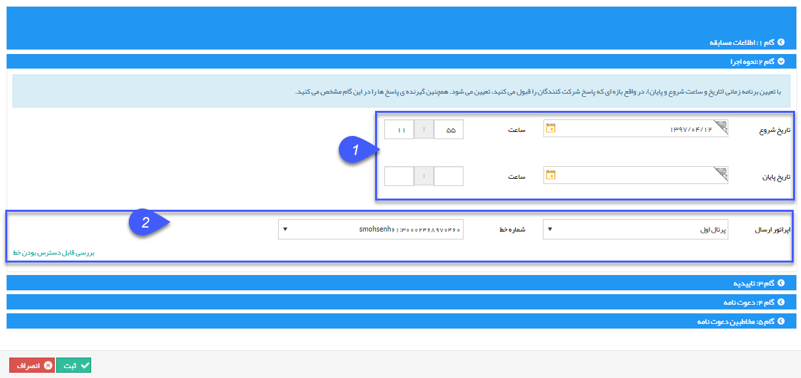

## گام2-نحوه اجرا

> **مسیر دسترسی**:  **تبلیغات** >**پیام‌کوتاه** > **مدیریت مسابقه‌ها** > **مسابقه جدید** > **نحوه‌ی اجرا** 

1. بازه اجرا :  تاریخ و ساعت  شروع و پایان بازه اجرا را تعیین کنید.

2. تعیین اپراتور ارسال : اپراتور مورد نظر برای ارسال،برای مثال پرتال اول ، رایان و ...  و در نهایت خط مورد استفاده باید انتخاب شود .

بررسی قابل دسترس بودن خط :  در این نوع از ارسال داشتن خط با قابلیت دریافت الزامی است، تا از طریق آن بتوان نظر مخاطبان را در بازه زمانی اجرای کمپین دریافت نمود ،

 در بازه اجرا خط مورد نظر نباید در برنامه دیگری مانند مسابقه و پاسخگوی خودکار و .... استفاده شود .  با استفاده از این کلید می شود بررسی کرد که خط مورد نظر مشغول است یا خیر 
 
 
 
  
