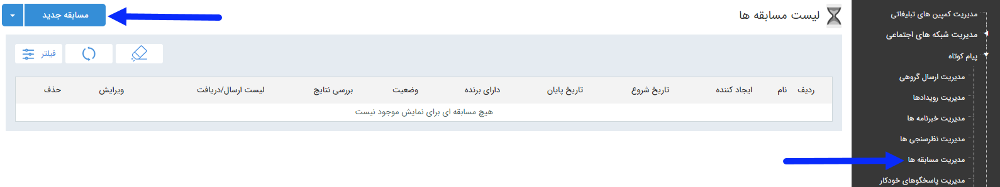

## صفحه‌ی اصلی مسابقه

> مسیر دسترسی:  **تبلیغات** >**پیام‌کوتاه** > **مدیریت مسابقه‌ها** 

با استفاده از این قابلیت می توان مسابقه ای ایجاد کردکه گزینه های مورد نظر را تعریف و گزینه صحیح و تعداد برندگان را مشخص نمود  و همچنین امکان انتخاب برنده  از بین پاسخ های صحیح وجود دارد . 

در صفحه اول، می توان با تعیین تاریخ اجرا،ایجاد کننده، نام برنامهو همچنین انتخاب وضعیت قرعخ کشی  و زدن دکمه فیلتر ، لیست برنامه های اجرا شده در گذشته را مشاهده کرد. اما برای اجرای یک برنامه جدید باید بر روی دکمه " مسابقه جدید" در سمت راست و بالای صفحه کلیک کرده و با گذراندن چند گام ساده، برنامه را به راحتی اجرا کرد.

لطفا ابتدا [اطلاعات مشترک بین ابزارها]( http://septadocs.1st.co.com/payamgostar/documents/%D8%A7%D8%B7%D9%84%D8%A7%D8%B9%D8%A7%D8%AA-%D9%85%D8%B4%D8%AA%D8%B1%DA%A9-%D8%A8%DB%8C%D9%86-%D8%A7%D8%A8%D8%B2%D8%A7%D8%B1%D9%87%D8%A7?selectedId=9481e722-68a9-460a-b2d6-57c228705581&menuItemType=1&versionId=a1cb5bd2-9978-4ca7-b9d6-08d951882868) را مطالعه فرمایید و طبق گام های زیر برای ارسال گروهی جدید اقدام فرمایید .

 گام 1- [اطلاعات مسابقه](http://septadocs.1st.co.com/payamgostar/documents/%D8%A7%D8%B7%D9%84%D8%A7%D8%B9%D8%A7%D8%AA-%D9%BE%DB%8C%D8%A7%D9%85-%D9%85%D8%B3%D8%A7%D8%A8%D9%82%D9%87?selectedId=ec470a4c-ca56-423f-9469-09db6a3fb821&menuItemType=1&versionId=a1cb5bd2-9978-4ca7-b9d6-08d951882868)

گام 2-  [نحوه اجرا]( http://septadocs.1st.co.com/payamgostar/documents/%D9%86%D8%AD%D9%88%D9%87-%D8%A7%D8%AC%D8%B1%D8%A7-%D9%85%D8%B3%D8%A7%D8%A8%D9%82%D9%87?selectedId=861e22ea-b4af-4449-a37f-abee4f749f48&menuItemType=1&versionId=a1cb5bd2-9978-4ca7-b9d6-08d951882868)

گام 3-  [تاییدیه]( http://septadocs.1st.co.com/payamgostar/documents/%D8%AA%D8%A7%DB%8C%DB%8C%D8%AF%DB%8C%D9%87-%D9%85%D8%B3%D8%A7%D8%A8%D9%82%D9%87?selectedId=113ab477-bba1-eb11-a032-ac1f6bc6cd90&menuItemType=1&versionId=a1cb5bd2-9978-4ca7-b9d6-08d951882868)

گام 4-  [دعوتنامه]( http://septadocs.1st.co.com/payamgostar/documents/%D8%AF%D8%B9%D9%88%D8%AA-%D9%86%D8%A7%D9%85%D9%87-%D9%85%D8%B3%D8%A7%D8%A8%D9%82%D9%87?selectedId=4c40cd36-9ff7-4fb5-8606-6a52a34aab66&menuItemType=1&versionId=a1cb5bd2-9978-4ca7-b9d6-08d951882868)

گام 5-  [مخاطبین دعوتنامه]( http://septadocs.1st.co.com/payamgostar/documents/%D9%85%D8%AF%DB%8C%D8%B1%DB%8C%D8%AA-%D8%AA%D8%A8%D9%84%DB%8C%D8%BA%D8%A7%D8%AA?selectedId=f4ed2522-d0e7-4334-f614-08d7db063b50&menuItemType=2#)

 
 
 
  

