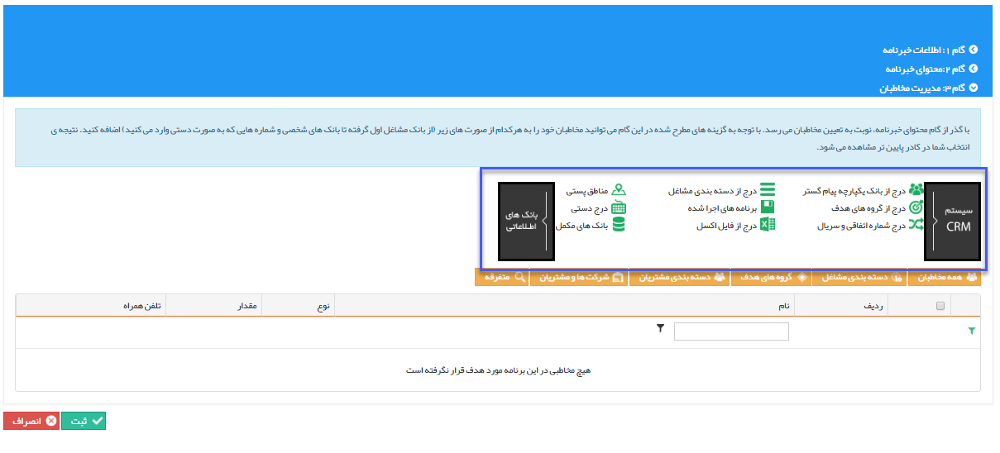

## گام3-انتخاب مخاطبان

> مسیر دسترسی:  **تبلیغات** >**پیام‌کوتاه** > **مدیریت خبرنامه‌ها** > **ارسال خبرنامه جدید** > **مدیریت مخاطبان خبرنامه** 

در قسمت [انتخاب مخاطبان]( https://github.com/1stco/PayamGostarDocs/blob/master/help2.5.4/Marketing/moshtarak-abzar/gam-se/select-Audience.md) ارسال گروهی پیام کوتاه توضیح داده شده است.

این مخاطبان باید شامل پروفایل هایی باشند که شماره تلفن همراه در آن ها وجود داشته باشد .

در این مرحله پس از انتخاب مخاطبان از بانک های اطلاعاتی، یک لیست از مخاطبان هدف ساخته می شود که با زدن دکمه ثبت، خبرنامه ایجاد و برنامه ی آن شروع به کار میکند.

>   نکته:  با زدن دکمه سیستم CRM میتوانید مخاطبان هدف خود را از هویت هایی که قبلا برای آن ها آیتم crm ثبت شده است انتخاب کنید .

