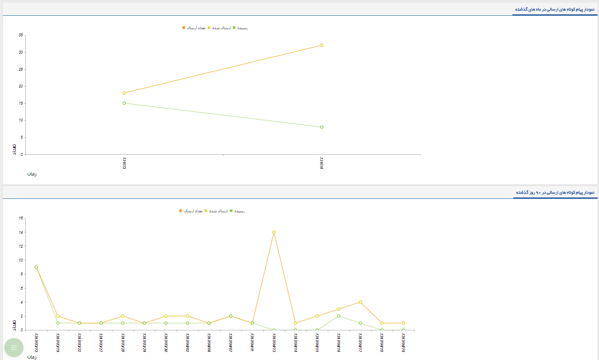

## پیام کوتاه

> مسیر دسترسی:  **تبلیغات** >**پیام‌کوتاه** 

در این بخش امکان مشاهده گزارش از ارسال پیام ها، بصورت نموداری می باشد که شامل دو نمودار می باشد :

نمودار پیام کوتاه های ارسالی در ماه های گذشته :  بصورت خودکار سه ماه گذشته نمایش داده می شود ، که در هر کدام از این ماه ها چه تعداد پیام ارسال شده و چه تعداد به مخاطب رسیده است .  

 

نمودار پیام کوتاه های ارسالی در 90 روز گذشته:  در این قسمت گزارش نموداری ارسال پیام ها در 90 روز گذشته نمایش داده می شود ، که در هر روز چه تعداد پیام ارسال شده و چه تعداد پیام رسیده به مخاطب داشتیم . 

[مدیریت ارسال گروهی پیامک]( http://septadocs.1st.co.com/payamgostar/documents/%D8%B5%D9%81%D8%AD%D9%87%E2%80%8C%DB%8C-%D8%A7%D8%B5%D9%84%DB%8C-%D8%A7%D8%B1%D8%B3%D8%A7%D9%84-%DA%AF%D8%B1%D9%88%D9%87%DB%8C-%D9%BE%DB%8C%D8%A7%D9%85%DA%A9?selectedId=9b40cbb9-49a8-4cb5-a601-76143fd367e6&menuItemType=1&versionId=a1cb5bd2-9978-4ca7-b9d6-08d951882868)

[رویداد تبلیغاتی]( http://septadocs.1st.co.com/payamgostar/documents/%D8%B5%D9%81%D8%AD%D9%87%E2%80%8C%DB%8C-%D8%A7%D8%B5%D9%84%DB%8C-%D8%B1%D9%88%DB%8C%D8%AF%D8%A7%D8%AF-%D8%AA%D8%A8%D9%84%DB%8C%D8%BA%D8%A7%D8%AA%DB%8C-%D9%BE%DB%8C%D8%A7%D9%85%DA%A9?selectedId=1d3ab477-bba1-eb11-a032-ac1f6bc6cd90&menuItemType=1&versionId=a1cb5bd2-9978-4ca7-b9d6-08d951882868)

[خبرنامه]( http://septadocs.1st.co.com/payamgostar/documents/%D8%B5%D9%81%D8%AD%D9%87-%DB%8C-%D8%A7%D8%B5%D9%84%DB%8C-%D8%AE%D8%A8%D8%B1%D9%86%D8%A7%D9%85%D9%87-%D9%BE%DB%8C%D8%A7%D9%85%DA%A9?selectedId=51fb3282-9f93-41a1-ba0e-a8b1438e0588&menuItemType=1&versionId=a1cb5bd2-9978-4ca7-b9d6-08d951882868)

 [نظرسنجی]( http://septadocs.1st.co.com/payamgostar/documents/%D8%B5%D9%81%D8%AD%D9%87%E2%80%8C%DB%8C-%D8%A7%D8%B5%D9%84%DB%8C-%D9%86%D8%B8%D8%B1%D8%B3%D9%86%D8%AC%DB%8C?selectedId=4a3da2c4-c4ec-46ed-8516-9ce84554f619&menuItemType=1&versionId=a1cb5bd2-9978-4ca7-b9d6-08d951882868)
 
[مسابقه]( http://septadocs.1st.co.com/payamgostar/documents/%D8%B5%D9%81%D8%AD%D9%87%E2%80%8C%DB%8C-%D8%A7%D8%B5%D9%84%DB%8C-%D9%85%D8%B3%D8%A7%D8%A8%D9%82%D9%87?selectedId=c71d7f3c-a121-47ba-9ba3-9ce12a2cf2dc&menuItemType=1&versionId=a1cb5bd2-9978-4ca7-b9d6-08d951882868)

[پاسخگوی خودکار]( http://septadocs.1st.co.com/payamgostar/documents/%D8%B5%D9%81%D8%AD%D9%87-%DB%8C-%D8%A7%D8%B5%D9%84%DB%8C-%D9%BE%D8%A7%D8%B3%D8%AE%DA%AF%D9%88-%D8%AE%D9%88%D8%AF%DA%A9%D8%A7%D8%B1?selectedId=143ab477-bba1-eb11-a032-ac1f6bc6cd90&menuItemType=1&versionId=a1cb5bd2-9978-4ca7-b9d6-08d951882868)

[لیست پیامک‌های ارسالی]( http://septadocs.1st.co.com/payamgostar/documents/%D9%84%DB%8C%D8%B3%D8%AA-%D9%BE%DB%8C%D8%A7%D9%85%DA%A9%E2%80%8C%D9%87%D8%A7%DB%8C-%D8%A7%D8%B1%D8%B3%D8%A7%D9%84%DB%8C-?selectedId=4d5c0f47-f8e9-4f82-550c-08d966729247&menuItemType=1&versionId=a1cb5bd2-9978-4ca7-b9d6-08d951882868)

[لیست پیامک‌های دریافتی]( http://septadocs.1st.co.com/payamgostar/documents/%D9%84%DB%8C%D8%B3%D8%AA-%D9%BE%DB%8C%D8%A7%D9%85%DA%A9-%D9%87%D8%A7%DB%8C-%D8%AF%D8%B1%DB%8C%D8%A7%D9%81%D8%AA%DB%8C?selectedId=3a01db51-4c90-4868-8d48-08d977603f16&menuItemType=1&versionId=a1cb5bd2-9978-4ca7-b9d6-08d951882868)

