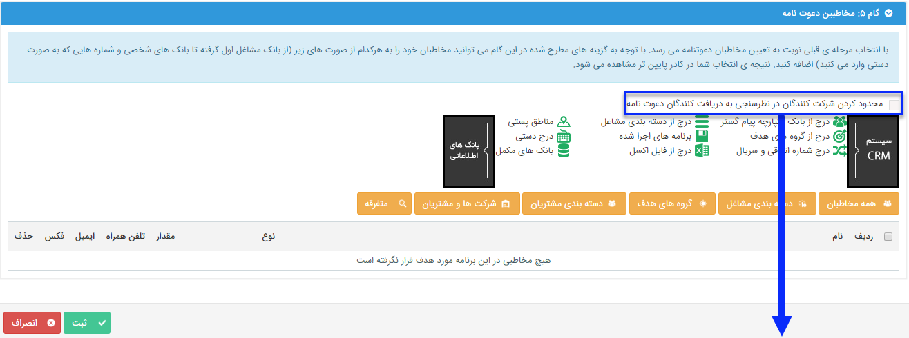

## گام5-انتخاب مخاطبان دعوتنامه

> مسیر دسترسی:  **تبلیغات** >**پیام‌کوتاه** > **مدیریت نظرسنجی** > **نظرسنجی جدید** > **مخاطبان** 

اگر در گام 4 تصمیم به ارسال دعوتنامه گرفته باشید، در این گام باید مخاطبان دعوتنامه را تعیین کنید.

در قسمت [انتخاب مخاطبان]( https://github.com/1stco/PayamGostarDocs/blob/master/help2.5.4/Marketing/moshtarak-abzar/gam-se/select-Audience.md) توضیح داده شده است.  

> نکته: در صورتی که ارسال دعتونامه را در این قسمت فعال کرده باشید، این برنامه حداقل باید یک مخاطب داشته باشد تا اجرا شود.

