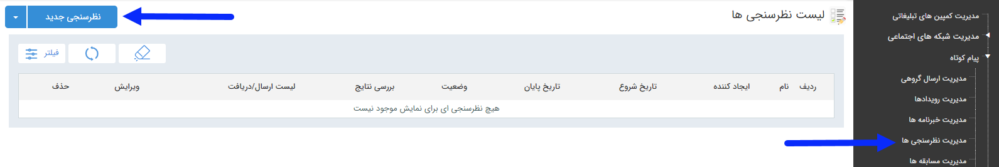

## نظرسنجی

> مسیر دسترسی:  **تبلیغات** >**پیام‌کوتاه** > **مدیریت نظرسنجی** 

برای آگاهی از نظرات مخاطبان خود در جهت بهبود برنامه های بازاریابی ، فروش و ... می توانید از نظرسنجی استفاده کنید. در صفحه اول، می توان با تعیین تاریخ اجرا،ایجاد کننده و نام برنامه  و زدن دکمه فیلتر، لیست برنامه های اجرا شده در گذشته را مشاهده کرد. اما برای اجرای یک برنامه جدید باید بر روی دکمه  "نظرسنجی جدید" در سمت راست و بالای صفحه کلیک کرده و با گذراندن چند گام ساده، برنامه را به راحتی اجرا کرد

لطفاابتدا [اطلاعات مشترک بین ابزارها](https://github.com/1stco/PayamGostarDocs/blob/master/help2.5.4/Marketing/moshtarak-abzar/moshtarak-abzar.md) را مطالعه فرمایید و طبق گام های زیر برای ارسال گروهی جدید اقدام فرمایید.

 گام 1- [اطلاعات مسابقه](https://github.com/1stco/PayamGostarDocs/blob/master/help2.5.4/Marketing/sms/survey/1-avalie-nazarsanji/avalie-nazarsanji.md)

گام 2-  [نحوه اجرا](https://github.com/1stco/PayamGostarDocs/blob/master/help2.5.4/Marketing/sms/survey/2-nahveajra-nazaesanji/2-nahve-ejra-nazarsanji.md)

گام 3-  [تاییدیه](https://github.com/1stco/PayamGostarDocs/blob/master/help2.5.4/Marketing/sms/survey/3-taid-nazarsanji/3-taid-nazarsanji.md)

گام 4-  [دعوتنامه](https://github.com/1stco/PayamGostarDocs/blob/master/help2.5.4/Marketing/sms/survey/4-davatname-nazarsanji/untitled.md)

گام 5-  [مخاطبین دعوتنامه](https://github.com/1stco/PayamGostarDocs/blob/master/help2.5.4/Marketing/sms/survey/5-mokhatab-davatname/5-entekhabmokhatab-nazarsanji.md)

