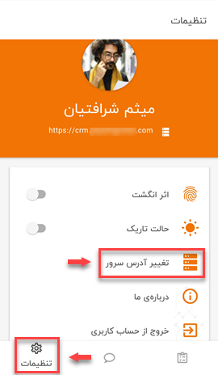
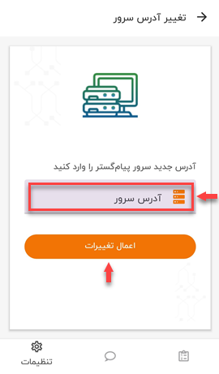

# تغییر آدرس IP نرم افزار

ممکن است که یک کاربر در چند شرکت فعالیت داشته باشد و همه‌ی آن‌ها از اپ نرم‌افزار CRM پیام‌گستر استفاده کنند؛ در این صورت برای انتقال بین نرم‌افزار شرکت‌ها باید آدرس سرور و یا IP اپلیکیشن خود را تغییر دهد تا به‌این صورت از حساب کاربری‌ش در شرکت اول خارج شده و به حساب کاربری‌ش در شرکت دوم وارد شود. یکی از کاربردهای دیگر تغییر آدرس IP برای انتقال از سرور اصلی به سرور تستی مجموعه است. 
برای این منظور باید از منوی پایین صفحه به پیج **تنظیمات**  رفته و گزینه‌ی **تغییر آدرس سرور**  را انتخاب کنید.

پس از انتخاب **تغییر آدرس سرور** به صفحه‌ای هدایت می‌شوید که باید آدرس سرور جدید را در آن قسمت وارد کرده و گزینه‌ی **اعمال تغییرات** را بزنید.

> **نکته** 
در این مرحله، نرم‌افزار برای احراز هویت و گرفتن تاییدیه یکی‌بودن فرد درخواست‌کننده با کاربر، درخواست اسکن اثرانگشت فرد متقاضی تغییر سرور را خواهد داشت. 

پس از وارد کردن آدرس IP جدید و اسکن اثرانگشت فرد، شما به صفحه‌ی اولیه‌ی ورود به نرم‌افزار منتقل می‌شوید که نام سرور جدید درخواستی‌تان در فیلد آدرس سرور ثبت گردیده و شما باید با وارد کردن نام کاربری و کلمه عبور IP جدید، لاگین کنید.
