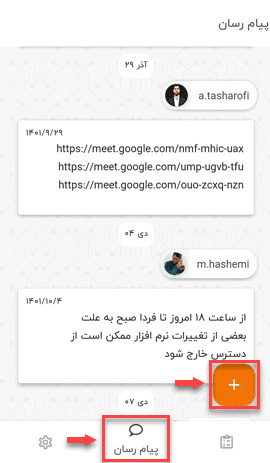
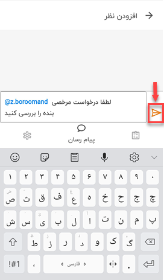

# ثبت نظر و ارتباط با سایر کاربران

یکی از نیازهای کاربران این است که در طول کار با هم در ارتباط باشند و بتوانند نظر و کامنت‌های خود را در مورد مباحث مختلف با یکدیگر به اشتراک بگذارند. برای این منظور باید از مسیر **منوی پایین صفحه** > **پیام رسان** اقدام نمایید. 
در صفحه‌ی *پیام رسان* لیست تمامی نظرات و کامنت‌هایی که خود و سایر همکاران در سیستم ثبت کرده‌اید را به‌صورت ترتیب‌بندی‌شده (Sort) به تاریخ، مشاهده خواهید کرد. 

برای اینکه بتوانید در اپلیکیشن پیام‌گستر نظر و کامنت خود را ثبت کنید، باید مراحل زیر را طی نمایید. 
**1)** از منوی پایین صفحه وارد تب **پیام رسان** شوید. 
**2)** روی علامت **پلاس** (+) کلیک کنید. 
**3)** با استفاده از **@** کاربر مدنظرتان را **Mention** کنید. 
**4)** آیکون **Send** را بزنید. 

