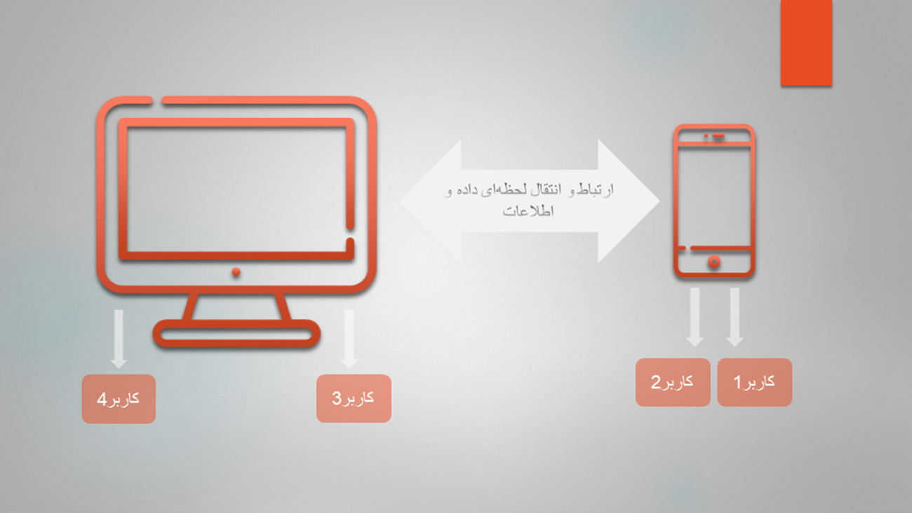

# ارتباط با نسخه تحت وب نرم افزار

یکی از ملزومات و ویژگی‌های نسخه‌ی اپلیکیشن نرم‌افزار پیام‌گستر، ارتباط و پیوستگی (Sink) آن با نسخه‌ی تحت وب است؛ دلیل این امر هم به‌ این صورت بوده که نمی‌شود یک آیتمی در نسخه‌ی وب ایجاد یا ادیت شود و کاربر دیگر که از نسخه‌ی اپلیکیشن نرم‌افزار استفاده می‌کند در جریان این مورد قرار نگیرد و یا دیر متوجه بشود زیرا این مورد امکان بروز خطا و اشتباه را در بسیاری از موارد ایجاد می‌کند. 
 برای مثال خریداری را در نظر بگیرید که پس از تهیه‌ی اجناس از شرکت شما، به مجموعه‌تان بدهکار شده و پس از چند وقت که مبلغ را به حساب شرکت واریز می‌کند، اطلاعات واریزی خود را به یکی از کاربران داده و کاربر مذکور واریزی را در نسخه‌ی تحت وب ثبت و تایید کند. حال اگر کاربر دیگر شرکت که از نسخه‌ی اپ نرم‌افزار استفاده می‌کند در جریان این امر قرار نگیرد و طبق روال کاری، از بدهکاران سیستمی، درخواست تسویه حساب نماید، علاوه بر خراب شدن جلوه شرکت و انتقال حس بی‌سر و سامانی مجموعه به خریدار، اصل درستی امور زیر سوال می‌رود. 

