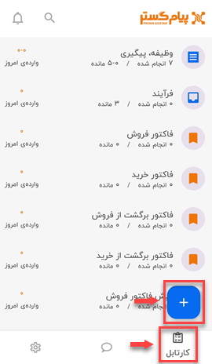
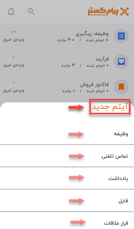
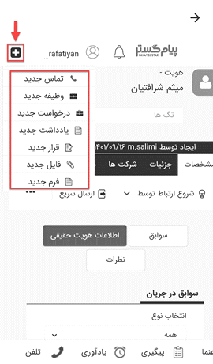

# ثبت سوابق جدید در نسخه موبایل

این امکان برای کاربران فراهم شده که بتوانند آیتم‌ها و سوابق جدیدی را از طریق نسخه اپلیکیشن به نرم‌افزار اضافه کنند. برای این کار باید از منوی پایین صفحه، گزینه‌ی کارتابل را انتخاب کرده و سپس بر روی علامت پلاس (+) بزنند.

در این مرحله برای کاربر پنجره‌ای باز می‌شود که از لیست کشویی آن می‌تواند سابقه و آیتم **وظیفه**، **تماس تلفنی**، **یادداشت**، **فایل**، **قرار ملاقات**، **فرم** و **درخواست پشتیبانی** جدید ثبت و به نرم‌افزار اضافه کند. 

کاربر با انتخاب هر سابقه، به صفحه‌ی ثبت مورد جدید در آن آیتم، هدایت می‌شود که می‌تواند اطلاعات و داده‌های خود را ثبت و بایگانی کند. گفتنی است فیلدهایی که باید برای ثبت هر سابقه جدید پر شود مشابه نسخه وب بوده و تفاوت خاصی با آن ندارد. 
گفتنی است که یکی از راه‌های دیگر اضافه کردن سابقه، رفتن به صفحه‌ی یک هویت خاص (با استفاده از سرچ) و زدن بر روی علامت پلاس بالای صفحه است. 

> نکته 
کاربر برای اضافه کردن سابقه جدید از طریق اپلیکیشن، می‌بایست از مسیر اعلام شده اقدام نماید به‌جز آیتم  **وظیفه** که می‌توانید به غیر از مسیر اعلام شده، از طریق صفحه‌ی کارتابل و انتخاب آیتم اصلی **وظیفه، پیگیری** به پیج مختص به این سابقه رفته و در آن‌جا با زدن علامت پلاس (+)، وظیفه‌ی جدید خود را ثبت نماید. 
