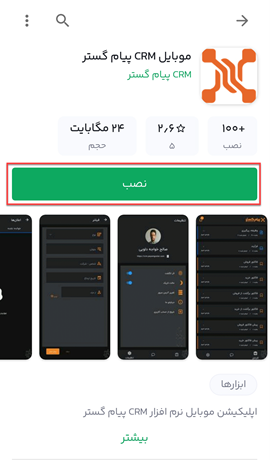
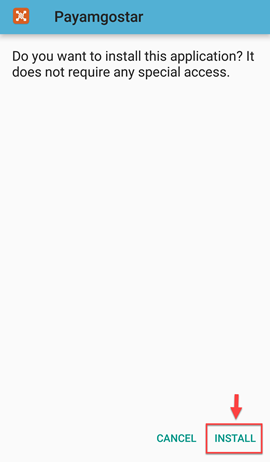
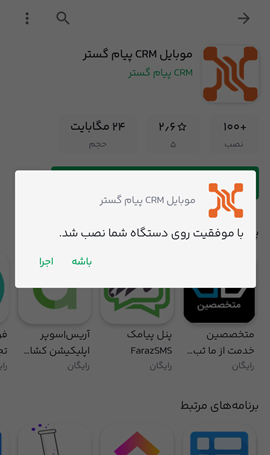

# نصب اپلیکیشن موبایل پیام گستر

برای نصب اپلیکیشن CRM پیام گستر، باید به این نکته توجه داشته باشید که این برنامه برای گوشی‌هایی با سیستم عامل **اندروید** طراحی شده و کاربرانی که سیستم عامل موبایلشان **IOS** بوده باید از نسخه‌ی **وب اپلیکیشن** استفاده کنند که تمامی ویژگی‌های اپلیکیشن (به‌ جز امکان ورود با اثر انگشت) را دارد. 
کاربران پس از جستجو و یافتن اپ پیام‌گستر در برنامه‌ی کافه بازار (Bazaar)، باید با زدن دکمه‌ی **نصب**، اولین گام از پروسه‌ی نصب این اپلیکیشن را روی گوشی موبایلشان بردارند. 

پس از دانلود اولیه و پایان این پروسه، پنجره‌ای باز می‌شود که شما باید برای ادامه‌ی نصب این اپلیکیشن، با زدن دکمه‌ی **Install** تاییده بدهید.

پس از پایان پروسه‌ی نصب نسخه‌ی موبایل نرم‌افزار، پیغام نصب موفق برایتان نمایش داده می‌شود که شما می‌توانید با زدن گزینه‌ی **اجرا** مستقیما در همان لحظه وارد برنامه شوید یا با کلیک بر روی دکمه‌ی **باشه**، پنجره را ببندید و بعدا از صفحه‌ی لیست گوشی همراهتان آن را برای استفاده باز نمایید.

