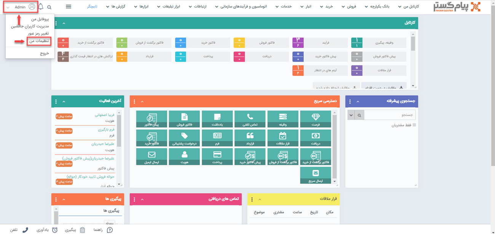
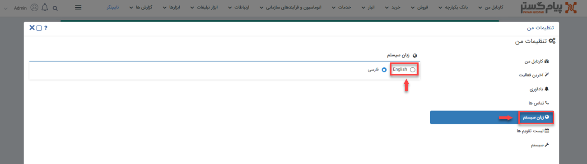

# تنظیمات زبان نرم افزار

این امکان برای شما فراهم شده که با توجه به نیاز و علاقه خود، زبان برنامه CRM پیام‌گستر را تغییر دهید. برای این‌منظور  باید از نسخه‌ی تحت وب نرم‌افزار اقدام کنید و نمی‌توان مستقیما تنظیمات آن را از روی نسخه‌ی اپلیکیشن انجام دهید. 
برای تغییر زبان، باید در نسخه‌ی وب، پس از کلیک بر روی قسمت نام کاربری در بالای صفحه و باز شدن منوی کشویی، از مسیر **تنظیمات من** > **زبان سیستم**، زبان مدنظرتان را از بین گزینه‌ها انتخاب نمایید. 

باید توجه داشته باشید که به محض کلیک بر روی هر گزینه، زبان برنامه عوض می‌شود و نیاز به تایید و یا ذخیره‌ی تغییرات نخواهید داشت. درصورتی‌که زبان مدنظر شما در بین گزینه‌ها نباشد، باید برای [تعریف زبان جدید](https://github.com/1stco/PayamGostarDocs/blob/master/help2.5.4/Basic-Information/Language-management/System-language/System-language.md) اقدام نمایید.
در این مرحله با بستن و باز کردن مجدد نسخه‌ی اپلیکیشن خواهید دید که تغییرات انجام شده بر روی نسخه‌ی وب، بر روی اپ نرم‌افزار هم اعمال شده و زبان برنامه تغییر کرده است. 
