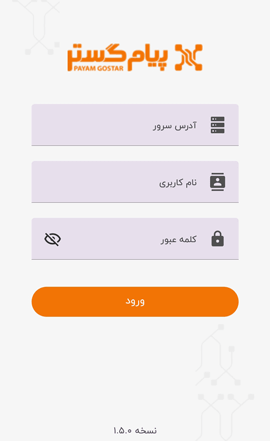
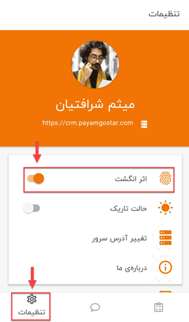

# راه های ورود به برنامه

برخی اوقات ممکن است کاربران بنا به دلایلی چون عدم دسترسی به سیستم، مرخصی رفتن پرسنل، دورکاری، مسافرت و... امکان استفاده از نسخه تحت وب نرم‌افزار را نداشته باشند و از طرف دیگر احتمال لزوم انجام یک کار، شرایطی را فراهم کند که کاربران مجبور به استفاده از اپلیکیشن نرم‌افزار شوند تا بتوانند کار و وظیفه محول شده به خود را در اولین فرصت انجام دهند. 
کاربران می‌بایست پس از نصب **اپلیکیشن پیام گستر** با نام کاربری و پسوردشان لاگین (ورود) کنند؛ در این مرحله در فیلد *آدرس سرور* باید IP مجموعه‌ موردنظر وارد شود. شما می‌توانید IP مجموعه‌تان را از لینک (URL) نسخه تحت وب‌تان بردارید. به‌طور مثال شرکتی را در نظر بگیرید که نامش *بامداد* باشد و از آی‌دی crm.bamdad.com استفاده کند، به‌طبع کاربرانش نیز باید همین عنوان را که در URL نسخه تحت وب مجموعه بامداد بوده، در فیلد *آدرس سرور* وارد کنند.

   

کاربران می‌توانند برای اینکه هربار مجبور به وارد کردن آدرس سرور، نام کاربری و کلمه عبور نباشند و سریع و بدون معطلی وارد برنامه شوند، از اسکن اثر انگشت برای ورود استفاده کنند. برای این منظور می‌بایست پس از لاگین کردن و ورود به نرم‌افزار، از منو پایین صفحه، وارد  **تنظیمات** (Settings) شده و گزینه‌ی اثرانگشت را فعال (On) کنند. پس از روشن کردن گزینه‌ی **اثر انگشت**، اپلیکیشن اثر انگشت ثبت شده شما در حافظه‌ی گوشی موبایل‌تان را برای ورود به نرم‌افزار ذخیره می‌کند و پس از آن برای ورودهای آتی، شما علاوه بر امکان لاگین شدن با نام کاربری، می‌توانید با اسکن اثر انگشت‌تان بدون معطلی به برنامه وارد شوید. 
شما می‌توانید پس از انجام این پروسه، برای رفرش (Refresh) شدن برنامه، یک‌بار از آن خارج شوید و مجدد لاگین کنید.

