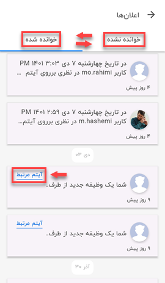

# مشاهده لیست اعلانات

برای همه‌ی ما پیش آمده که به دلایل مختلف اعم از مشغله‌های کاری زیاد، دغدغه‌های ذهنی، فراموشی، سهل‌انگاری، نداشتن زمان کافی و... نتوانیم پیام‌های مربوط به حساب کاربری‌مان را بررسی کنیم؛ بهترین راه‌کار در این زمان استفاده از نوتیفیکیشن (Notification) یا همان اعلانات به‌عنوان یادآوری و یا میانبری برای در جریانِ پیام قرار گرفتن در کوتاه‌ترین زمان است. 
در نسخه اپ پیام‌گستر (همانند نسخه وب) امکان مشاهده‌ی پیام‌های سیستمی (هم‌چون وظایف، منشن شدن در نظرات و...) از آیکون اعلانات (زنگوله) وجود دارد.  این امکان به کاربران کمک زیادی می‌کند که در سرشلوغی‌های کاری که ممکن است نتوانند پیام‌های سیستمی خود را از جایگاه اصلی‌اش چک کنند، از آن به‌عنوان یادآوری و یا مسیر میانبر استفاده نمایند. 
کاربر برای مشاهده‌ی لیست اعلانات می‌بایست از منوی پایین صفحه، گزینه‌ی **کارتابل** را انتخاب نموده و سپس بر روی آیکون زنگوله کلیک کند. 

> نکته 
عدد کنار آیکون زنگوله، نشان‌دهنده‌ی تعداد پیام‌های سیستمی خوانده نشده، توسط کاربر است. 

با کلیک بر روی زنگوله وارد صفحه‌ی مربوط به اعلانات می‌شوید و در آن‌جا تمامی پیام‌ها و یادآوری‌های سیستمی را می‌توانید در دو لیست جداگانه‌ی **خوانده شده** و **خوانده نشده** مشاهده کنید. در هر کدام از این لیست‌ها، پیام‌ها به‌تاریخ مرتب (Sort) شده و شما در ابتدا جدیدترین اعلان را در بالای صفحه خواهید دید. 

ممکن است برخی از آیتم‌ها نیاز به بررسی بیشتری داشته باشند و کاربر بخواهد به صفحه‌ی مربوط به آن برود و پس از مشاهده‌ی کامل، اقدامات بعدی را بر روی آن انجام دهد؛ برای این منظور می‌توانید از گزینه‌ی **آیتم مرتبط** استفاده کنید و با کلیک بر روی آن به صفحه‌ی مدنظر وارد شوید. 
در صورت تمایل برای حذف هر اعلان، می‌بایست پس از انتخاب آن، بر روی علامت حذف (سطل زباله) که پس از انتخاب مورد برایتان در بالای صفحه ظاهر می‌شود، کلیک کنید.
