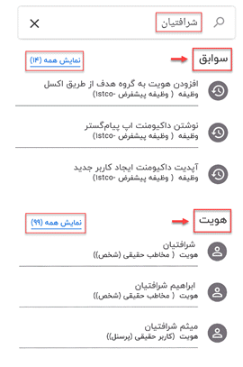

# جستجو در سوابق و هویت ها

ممکن است که کاربران بنا به هر دلیلی بخواهند نام یا عبارتی را در بین سوابق و هویت‌ها جستجو کنند، این امکان برای آن‌ها فراهم شده تا با انتخاب کارتابل از منوی پایین صفحه و زدن روی علامت سرچ (ذره‌بین) بتوانند لیستی از تمامی سوابق (وظیفه، فرم و...) و هویت‌ها که عنوان مدنظر در یکی از فیلدهای آن اعم از عنوان، توضیحات، خلاصه سابقه و... آمده است را مشاهده نمایند. 

پس از تایپ عنوان مدنظر در قسمت سرچ‌بار ابتدا لیست تمامی **سوابق** و سپس لیست تمامی **هویت‌**هایی که واژه جستجو شده در یکی از فیلدهای آن آمده، برای شما نمایش داده می‌شود.

کاربران پس از بررسی لیست ارائه شده و انتخاب مورد منظور، وارد صفحه‌ی مرتبط با هویت یا سابقه می‌شوند و در آن‌جا تمامی اطلاعات مختص به آن را مشاهده و در صورت تمایل تغییر داده یا ادیت می‌کنند.