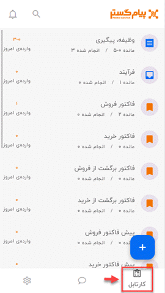
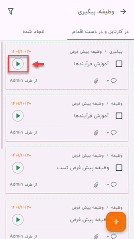
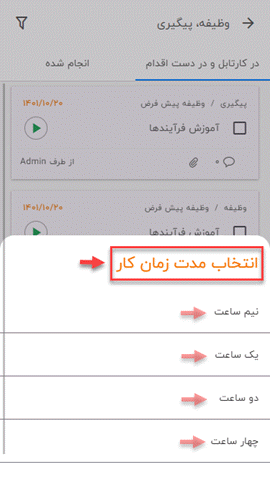
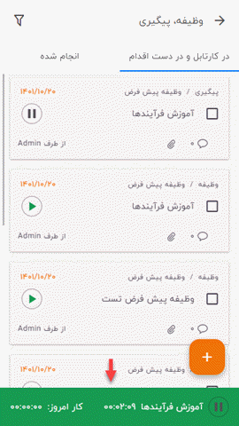

# همگام سازی اپلیکیشن پیام گستر با نرم افزار تایم نگر

نرم افزار تایم‌نگر این امکان را به شما می‌دهد که بتوانید زمان شروع و توقف کار روی هر وظیفه را مشخص کنید  تا به این ترتیب با گرفتن گزارش، هم نحوه‌ی عملکرد خود و افراد زیرمجموعه‌تان را بسنجید و هم مدیریت زمان بهتری داشته باشید. شما می‌توانید در اپلیکیشن پیام‌گستر از نرم‌افزار تایم‌نگر استفاده کنید و به‌وسیله‌ی آن زمان انجام برخی از فعالیت‌های خود را ثبت کنید. 
برای ایجاد ارتباط بین این دو نرم‌افزارهای باید مراحل زیر را طی نمایید: 
**1)** ابتدا نرم افزار تایم‌نگر را بر روی گوشی موبایل خود **نصب** کنید و با حساب کاربر‌ی‌تان وارد برنامه شوید. می‌توانید برای آشنایی با چگونگی انجام این کار، صفحه‌ی [شروع به کار با نرم‌افزار تایم‌نگر](https://github.com/1stco/PayamGostarDocs/blob/master/timenegar/LoginTimeNegar/LoginTimeNegar.md) را مطالعه کنید. 
**2)** وارد اپلیکیشن پیام گستر شوید و مسیر **منوی پایین صفحه** > **کارتابل** را طی نمایید.

**3)**  در این مرحله باید یکی از آیتم‌های **وظیفه**، **پیگیری‌**، **فرآیند** **و قرار ملاقات**  را که امکان ثبت زمان شروع و توقف کار بر روی‌‌شان وجود دارد، انتخاب کنید.  پس از ورود به صفحه‌ی آن آیتم (برای مثال ما اینجا آیتم وظیفه را انتخاب کردیم) یکی از وظایفی که از قبل در سیستم ساخته‌اید و در کارتابل‌تان وجود دارد را انتخاب کنید و برای شروع ثبت زمان، روی علامت **Play** (فلش سبزرنگ) بزنید.  

**4)** حال باید **زمان توقف تایم‌شمار** یا به‌عبارت‌دیگر مدت زمانی که می‌خواهید روی آن آیتم، کار کنید را مشخص نمایید و بگویید انجام این وظیفه  که قصد زمان‌سنجی آن را دارید چه مدت طول می‌کشد که نرم‌افزار پس از گذشت آن زمان، به‌طور خودکار تایمر را Stop کند. اگر انجام آن وظیفه زودتر از تایم انتخابی تمام شود، می‌توانید به‌صورت دستی زمان‌سنج را متوقف نمایید و در صورتی‌که انجام وظیفه بیشتر از تایم انتخابی طول بکشد، باید بعد از گذشت زمان انتخاب‌شده و متوقف شدن زمان‌سنج، دوباره تایمر را Play نمایید. این زمان به‌طور پیش‌فرض، هشت ساعت در نظر گرفته شده و می‌توانید آن را با مقادیر نیم ساعت، یک ساعت، دو ساعت، چهار ساعت و هشت ساعت عوض کنید. 

**5)**  پس از انتخاب یکی از گزینه‌ها برای مشخص شدن زمان توقف، نرم‌افزار به‌صورت خودکار **شروع به ثبت زمان** می‌کند و نوار سبزرنگ زمان‌سنج، برای‌تان در پایین صفحه  به‌نمایش درمی‌آید. این قسمت شامل دو تایمر بوده، در زمان‌سنج اولی که نام وظیفه هم مقابل‌اش بیان شده، کل زمانی را که روی آن وظیفه صرف کرده‌اید را برای‌تان نمایش می‌دهد و اما در زمان‌سنج دوم شما می‌توانید ، مجموع زمانی را که در همان روز، صرف وظیفه‌ی موردنظر کرده‌اید را ببینید.

>**نکته** 
یکی از امکانات ویژه‌ای که تایم‌نگر برای شما فراهم کرده، امکان **دریافت گزارش‌های مختلف** است. با این قابلیت می‌توانید به داشبورد کاربری افراد زیر مجموعه‌ی خود (با توجه به حکم پرسنلی) دسترسی داشته باشید و با کمک گزارش‌هایی که به تفکیک کاربران، دپارتمان‌ها، گروه‌ها و سمت‌ها می‌گیرید، عملکرد خود و افراد زیرمجموعه‌تان را بسنجید و مدیریت و تسلط بهتری بر شرایط و اوضاع کار داشته باشید.
