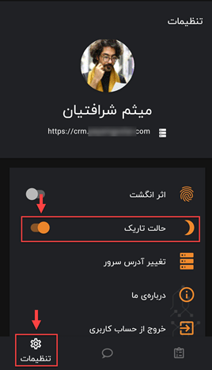

# تغییر تم نرم‌افزار موبایل

یکی از امکانات نسخه‌ی اپلیکیشن CRM پیام‌گستر، امکان تغییر پس‌زمینه و یا همان پوسته‌ نرم افزار است. با توجه به اختلاف سلیقه‌ی اشخاص و افزایش تمایل افراد به استفاده از تم تاریک (Dark theme) از غروب تا طلوع آفتاب، این ویژگی برای کاربران فراهم شد. 
برای تغییر تم از حالت روز به حالت شب در اپ نرم‌افزار پیام گستر، می‌بایست به صفحه‌ی **تنظیمات** (Settings) از منوی پایین صفحه رفته و سپس  گزینه‌ی **حالت تاریک** را فعال کنید. 

 

>نکته 
پس زمینه تاریک (Dark mode) که به آن حالت شب (Night mode) هم می‌گویند باعث می‌شود در ساعات تاریکی هوا، چشم فرد هنگام کار با نرم‌افزار کمتر خسته و اذیت شود و آن هم به‌دلیل کاهش نور آبی‌ای است که از موبایل کاربر می‌تابد و در نهایت راحتی و سلامت شخص را هنگام کار افزایش می‌دهد. 
