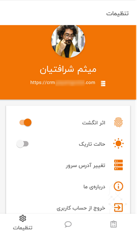

# اطلاعات حساب کاربری در اپلیکیشن

زمانی که در اپلیکیشن وارد می‌شوید، می‌توانید از منو پایین صفحه، گزینه تنظیمات (Settings) برخی از اطللاعات حساب کاربری خود را مشاهده کنید. از جمله این اطلاعات می‌توان به تصویر پروفایل، نام و نام‌خانوادگی و آدرس سرور اشاره کرد. گفتنی است که این موارد (به‌جز آدرس سرور) از اپلیکیشن قابل ادیت و یا تغییر نبوده و برای اعمال هرگونه تغییری بر روی این موارد می‌بایست به نسخه تحت وب مراجعه نمایید.

