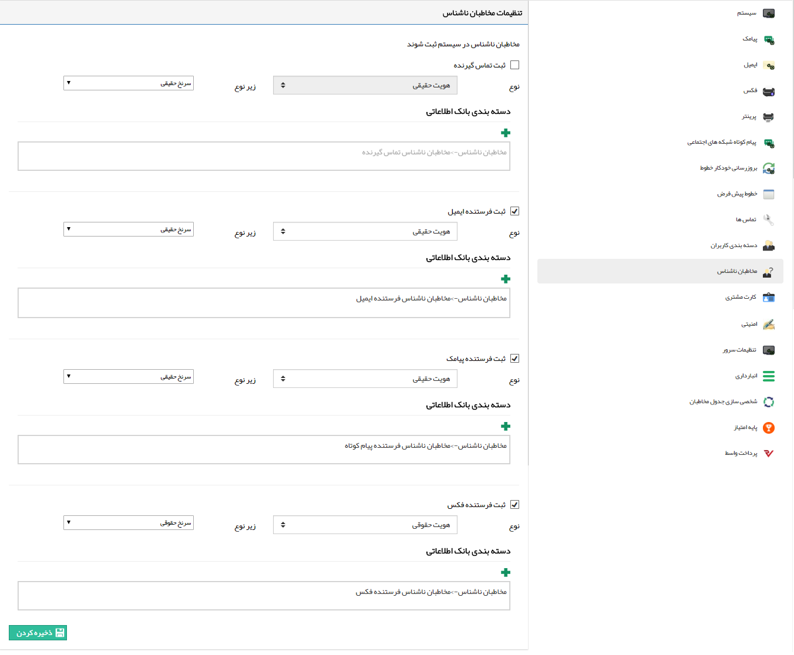

## تنظیمات مخاطبان ناشناس

 درصورت ارتباط مخاطبان ناشناس با شما از طریق تماس تلفنی، پیام کوتاه، ایمیل و فکس در بانک اطلاعاتی در دسته‌بندی‌ای که شما مشخص می‌کنید، یک پروفایل بر اساس زیرنوع هویت تعیین شده، به صورت خودکار توسط سیستم ساخته می‌شود.

> نکته: توجه داشته باشید از آنجایی که امکان تشخیص نام هویت ناشناس برای سیستم وجود ندارد، در پروفایل ذخیره شده، اطلاعات تماس آن ابزار ارتباطی (موبایل، ایمیل، تلفن یا فکس) به عنوان نام در نظر گرفته خواهد

برای مثال در خصوص تماس تلفنی در صورتی که شخصی با شرکت تماس حاصل نماید و شماره تماس گیرنده در هیچ یک از پروفایل های بانک اطلاعاتی ثبت نشده باشد، این شماره به عنوان یک پروفایل در دسته بندی مشخص شده در این تنظیمات ثبت می شود و سوابق آن شماره (تماس های بعدی و یا پیامکی که از آن خط دریافت شود) در آن پروفایل ذخیره می گردد.

در موارد دیگر مانند ثبت فرستنده ایمیل، ثبت فرستنده پیامک و ثبت فرستنده فکس نیز در صورتی که دسته بندی مشخص شود، مانند مثال بالا عمل می کند و ارسال کننده ناشناس را ثبت می نماید .
