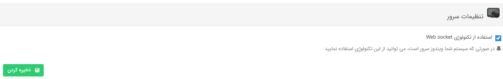

## تنظیمات سرور

>  مسیر دسترسی:  **تنظیمات** >**تنظیمات کلی** > **تنظیمات سرور** 

با فعال بودن این گزینه در صورتی که ویندوزی که نرم افزار روی آن نصب است از نوع سرور باشد، پاپ آپ یادآوری به صورت اتوماتیک باز می شود.

توجه کنید تنها در صورتی که ویندوز شما، ویندوز سرور باشد میتوانید از این تکنولوژی استفاده نمایید.

